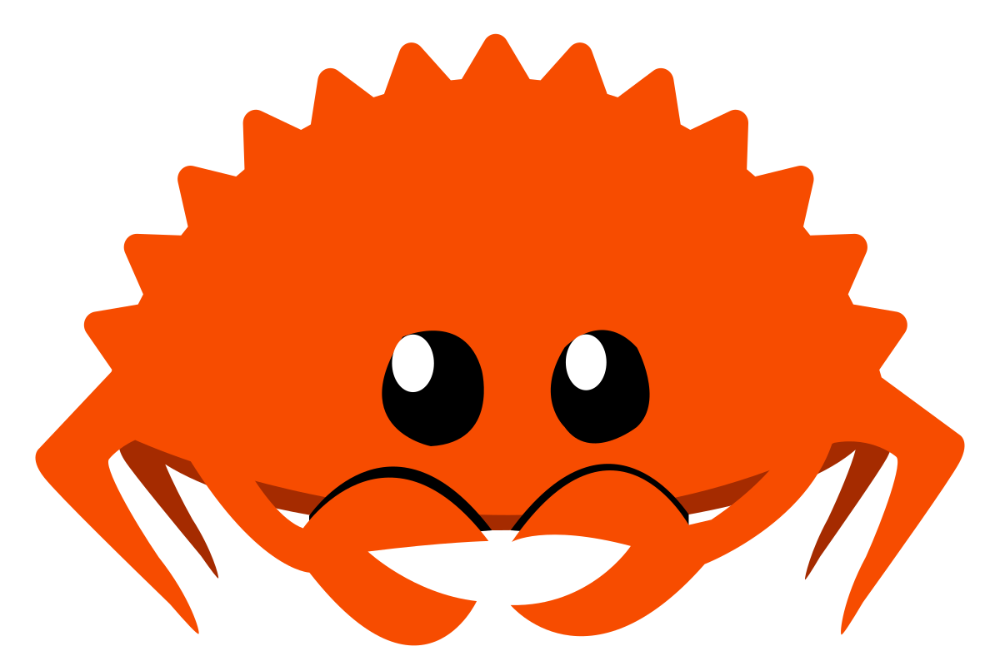
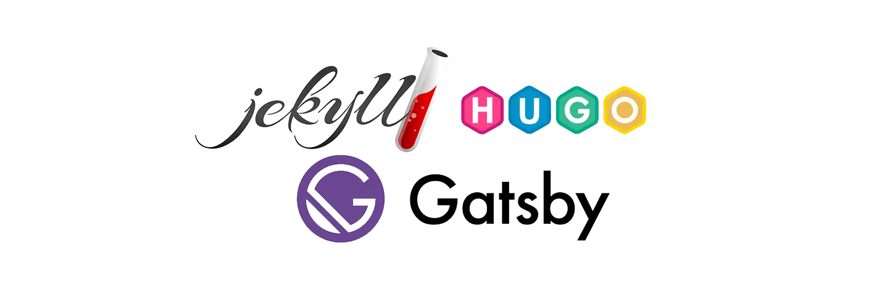
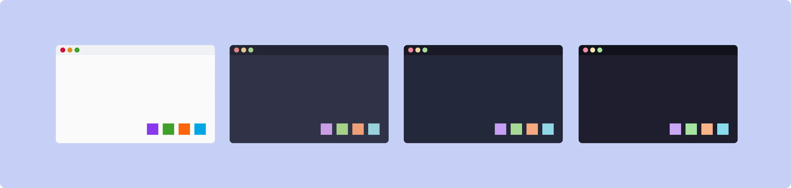
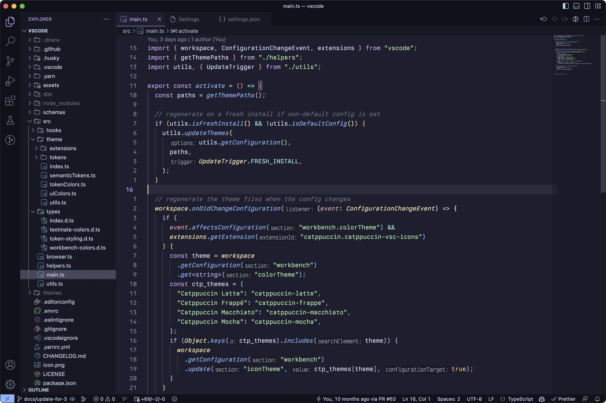
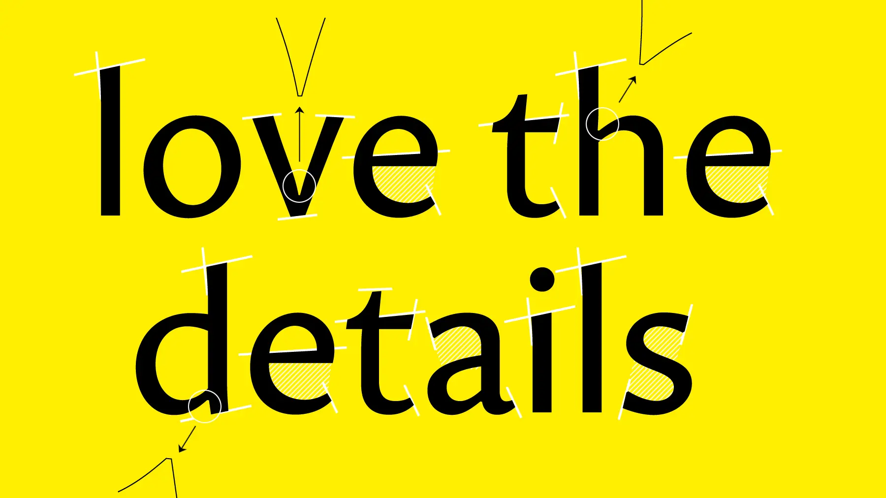
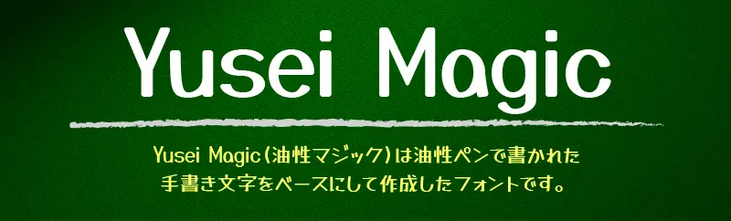

+++
title = "How This Site is Made"
slug = "how-this-site-is-made"
description = "Overview of the tools and process used to make this site!"

[taxonomies]
tags = ["meta"]

[extra]
has_toc = true
+++

After a couple days work, the site is done and launched! I thought it would be fun to go over how
the site is made and talk about the cool tools and open source things I used to make it. So I will,
and you can't stop me.

<!-- more -->

## The Goal

As much as I like to riff on HTML and CSS and JavaScript and how wonky and weird and bad they are,
at the end of the day I have to admit that despite it all, I really love making websites. I love
designing their shape and color and trying to make the content look and flow the best it can. It's
also just so fast to get something finished and polished in just a few days.

The goal with this website is to make a simple, personal blog where I could post whatever I wanted,
but could focus on posts about game development and especially Rust. I'd say I'm probably one of
the most experience game developers using Rust for my main project these days, at least as far as
indie is concerned, and I get a lot of interest and questions from other developers who are
*Rust-curious*.

<figure>
    
    <figcaption>Ferris comes for us all one day, she is inevitable.</figcaption>
</figure>

Because the blog will feature a lot of posts about Rust, a notoriously difficult programming language
to learn, I wanted it to be very gentle and approachable. It also needed to support a lot of code-
friendly features such as syntax highlighting, a [Q&A](/ask) system of some sort, a way to report
errors or confusing sections, and provide post categorization.

I also wanted it to be open source and also to be made using as much *FOSS* (free open source software)
as possible. And I did it! Hopefully learning how this website is made will be helpful to others who
may want to create their own, or are just curious about such technicalities.

## Zola the Static Site Generator

I've toyed with many static site generators in the past, but the one I like to use lately is
[Zola](https://www.getzola.org/), and is what I used to make this site.

If you're not familiar with the term, a static site generator (SSG) is a tool that lets you use a
templating build system to develop your website *as if* it was dynamically loaded. But it is not, and
instead an HTML page is generated for every single section/post on the site.

### Why Use an SSG?

While SSGs can generate larger footprints because so much HTML has to be copied over-and-over again,
they also tend to produce sites that are very stable and fast to load. But the reason I like them isn't
really because of that.

What I like is that I don't really need any kind of special content management system (CMS), and don't
even have to be connected to the internet to write and edit posts. It's also great that the entire site
can exist in a git repo, and building it is as simple as cloning the repo and installing/running one
command-line tool.

SSGs are extremely suited to small personal blogs and simple website, in my opinion, and are also just
really fun to use. Which is important!

### Why Use Zola?

There are many SSGs out there, and several of those (like [Hugo](https://gohugo.io/) or
[Jekyll](https://jekyllrb.com/)) are very popular as well. In fact, for beginners they may be better
starting points because there's more documentation, tutorials, and free themes available for them.



Zola isn't particularly special, but it *is* made in Rust, which I think is very cool. It is
[open source](https://github.com/getzola/zola), which is cool, and is fairly minimal. It has *just*
the right amount of tools for me, tools that I like to use, without feeling bloated:

- simple markdown for editing posts
- [SASS](https://sass-lang.com/) support for writing stylesheets
- easy templating with [Tera](https://keats.github.io/tera/)
- custom post metadata that templates can access
- file hashing &amp; table of content generation
- run locally and listen for live changes while you write posts
- support for drafts (only visible locally)

## Catppuccin Color Theme

When it came to designing the site, I couldn't resist using [Catppuccin](https://catppuccin.com/),
my current favorite color theme. It's a beautiful, pastel palette that even comes with a handy
[style guide](https://github.com/catppuccin/catppuccin/blob/main/docs/style-guide.md) on how to
use it effectively.



The **Mocha** flavor is my favorite syntax theme for coding, and is available for most major code
editors if you're interested.



## The Fonts

I wanted three main fonts for the site:

- a main text font
- a title/header font
- a code font

I always struggle choosing fonts, as there are so many of them and I totally go down a rabbit
hole when browsing them and can lose a lot of time without realizing it. Luckily I was able to
find what I wanted and settle on three great ones this time around after only a few hours of
searching.

### Proza Libre

I wanted the main text font to be crisp and readable, but not too stuffy or boring. Fun fonts
can pose an accessibility problem, so I didn't want to get too crazy. This is why I was
delighted when I found [Proza](https://bureauroffa.com/about-proza), a beautiful humanist sans-
serif family of fonts created by Jasper de Waard.



It's got just enough varying line widths and little hooks and wedges to give it character, but
not too much to cause strain when reading large amounts of text (in my opinion). For this site,
I am using the open source variation [Proza Libre](https://github.com/jasperdewaard/Proza-Libre),
which is tuned for small text readability.

### Yusei Magic

Header fonts are where you can have a bit more fun, since they are large, pronounced, and not
used for text read in volume. I discovered [Yusei Magic](https://github.com/tanukifont/YuseiMagic)
last year, a gorgeous multilingual hand-written style font by Japanese designer *Tanukizamurai*,
and have been looking for an excuse to use it ever since.



If you like this font, you should also check out their [Tanugo](https://github.com/tanukifont/Tanugo)
set of fonts, which are very similar but have a few more style and letter shape options.

### Fira Code

The most boring choice of the three is my tried-and-true coding font of choice,
[Fira Code](https://github.com/tonsky/FiraCode). I've been using this font as my main programming
font for many years now, and every time I try to switch I find myself coming back to it.

Last year I did a blind run of [codingfont.com](https://www.codingfont.com/) to see if maybe there
was some other font out there that was more suited to me.

...I still ended up choosing Fira Code. It just hits all the right spots for me, and I am also one
of *those* people who really like displaying my code with ligatures, and having support for that is
always a bonus.

> Rust code
```rust
fn main() -> usize {
    // Iterate over all integers from 4 to 10
    let mut value = 4;
    while value <= 10 {
         println!("value = {value}");
         value += 1
    }

    // Using `for` with range syntax for the same functionality
    for value in 4..=10 {
        println!("value = {value}");
    }
}
```

Unfortunately I don't actually know how to enable ligatures in Zola (if it's even possible), but
I'll do so later if I can figure it out.

## Remix Icons

I love to use icons in my content. They're a great way to add visual variety to the text, draw
attention to or accent certain elements of the UI, and are just kinda cute and friendly overall.

Many folks are probably aware of the popular [Font Awesome](https://fontawesome.com/) icon set,
which is very high quality and I have used before in the past. But this time around, I decided to
use [Remix Icon](https://remixicon.com/), a wonderful open source alternative.


It's not as full-featured, and I don't like some of the icons as much, but it's still got hundreds
of icons to choose from and has most of the essentials. They're great for socials, directional
arrows, file types...

<div style="text-align:center">
    <i style="font-size:2em; margin-right:5px" class="ri-twitter-fill"></i>
    <i style="font-size:2em; margin-right:5px" class="ri-github-fill"></i>
    <i style="font-size:2em; margin-right:5px" class="ri-mail-fill"></i>
    <i style="font-size:2em; margin-right:5px" class="ri-bluesky-fill"></i>
    <i style="font-size:2em; margin-right:5px" class="ri-mastodon-fill"></i>
    <i style="font-size:2em; margin-right:5px" class="ri-linkedin-fill"></i>
    <i style="font-size:2em; margin-right:5px" class="ri-discord-fill"></i>
</div>

<div style="text-align:center">
    <i style="font-size:2em; margin-right:5px" class="ri-arrow-left-up-line"></i>
    <i style="font-size:2em; margin-right:5px" class="ri-arrow-up-line"></i>
    <i style="font-size:2em; margin-right:5px" class="ri-arrow-right-up-line"></i>
    <i style="font-size:2em; margin-right:5px" class="ri-arrow-right-line"></i>
    <i style="font-size:2em; margin-right:5px" class="ri-arrow-right-down-line"></i>
    <i style="font-size:2em; margin-right:5px" class="ri-arrow-down-line"></i>
    <i style="font-size:2em; margin-right:5px" class="ri-arrow-left-down-line"></i>
    <i style="font-size:2em; margin-right:5px" class="ri-arrow-left-line"></i>
</div>

<div style="text-align:center">
    <i style="font-size:2em; margin-right:5px" class="ri-file-image-line"></i>
    <i style="font-size:2em; margin-right:5px" class="ri-file-text-line"></i>
    <i style="font-size:2em; margin-right:5px" class="ri-file-code-line"></i>
    <i style="font-size:2em; margin-right:5px" class="ri-file-video-line"></i>
    <i style="font-size:2em; margin-right:5px" class="ri-html5-line"></i>
    <i style="font-size:2em; margin-right:5px" class="ri-music-2-fill"></i>
    <i style="font-size:2em; margin-right:5px" class="ri-font-size-2"></i>
</div>

...and all sorts of other things! And since they're vector shapes, they scale nice and smoothly
along with the fonts.

## Deploying

The final (and maybe most important) piece of the puzzle is actually uploading the site, and
also uploading new posts as I write them. I really want writing new posts to be as effortless
as possible, and to require the least amount of work possible to do.

### GitHub &amp; CloudFlare Pages

Thankfully, some friends helped set me up with the current solution: I have the site stored in
a public [GitHub repository](https://github.com/chevyray/chevyray.dev), and connect [CloudFlare](https://www.cloudflare.com/)
to it to build the site whenever it detects the repository has changed.


One day I will sit down and see if I can get a process like this working myself so I don't have
to rely on these companies to do it for me.

But for now, this is a great solution because now
whenever I want to write a new post, I just create a `md` file, write the post, and then commit
the changes. As soon as I do that, a new build is deployed and the online site is updated!

Hopefully all this will contribute to a lot of good content for you all.

### Source Code for Posts

One clever feature of the site that I am proud of is that every post has a link at the bottom of
it directly to the source code for that post in the git repo! Because Zola provides a relative
permalink for each post in the template, and the folder structure for posts matches the outputted
URL paths, I can just append it to a link to the respective directory in the repository itself!

> templates/feedback.html
```html
<p class="feedback">
    If you find errors or have suggestions, you can visit the
    <a href="https://github.com/ChevyRay/chevyray.dev/tree/main/content/{{ page.relative_path }}" target="_blank">
    source code for this post</a> directly to file an issue or submit a pull request.
</p>
```

This means that if someone finds an error in a post (such as incorrect code, misleading information,
broken links, or typos), they can just click the link and report the error directly. They could
even just edit it directly using GitHub's online text editor and submit the fix immediately.

No tweeting me, no emails, nothing. Just a couple clicks and a fix is on the way. This might not
actually get used, but I think the idea is great and is a feature I would love to see more
educational sites and programming blogs support.

### Hashing Query Strings

One other small but useful thing I did was make it so that if the linked CSS or JS files change,
they trigger cache reloads on browsers that have visited the website before.

This was essential when building the site because when I would go to test it on my phone, the
browser would cache the stylesheets to save bandwidth and I wouldn't see my latest changes
reflected.

Luckily, Zola provides a handy `get_hash()` function that worked perfectly here. Basically,
every time the base template gets generated, it looks at the CSS file it is embedding and
generates a hash string out of it. I then append this as a
[query string](https://developer.mozilla.org/en-US/docs/Web/API/URLSearchParams) onto the
CSS url.

> base.html
```html

<link rel="stylesheet" href="/latte.css?{{ hash }}" id="sheet-link">
```

This way, whenever the CSS file changes, the URL will also change (even though the filename
itself has not), and anything that cached the CSS associated with the old URL will
discover a new one in its place when the page loads, triggering a stylesheet refresh.

## Conclusion

That's it! I might update this page with if things are missing or people have more questions, but
I thought it would be fun to kick off the new website with a little post about the cool open source
ingredients that it's made out of.