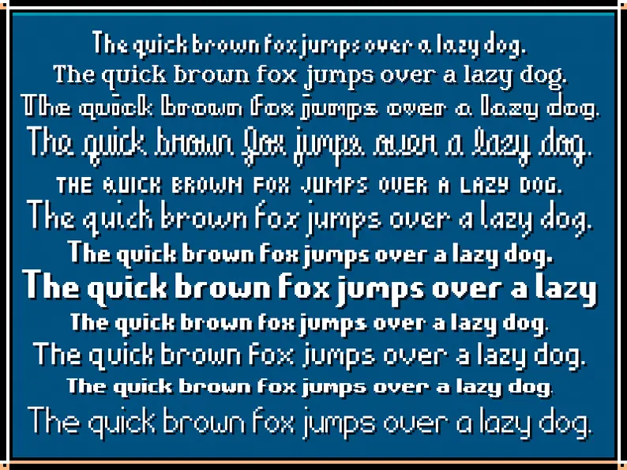
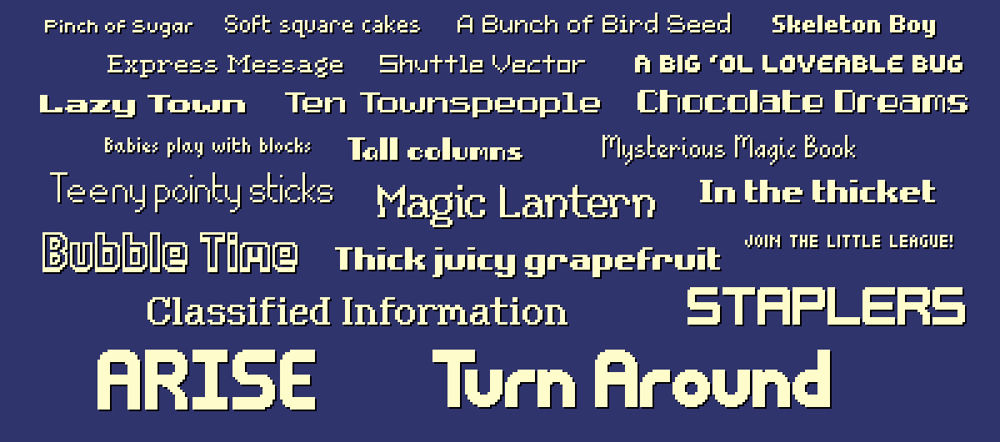
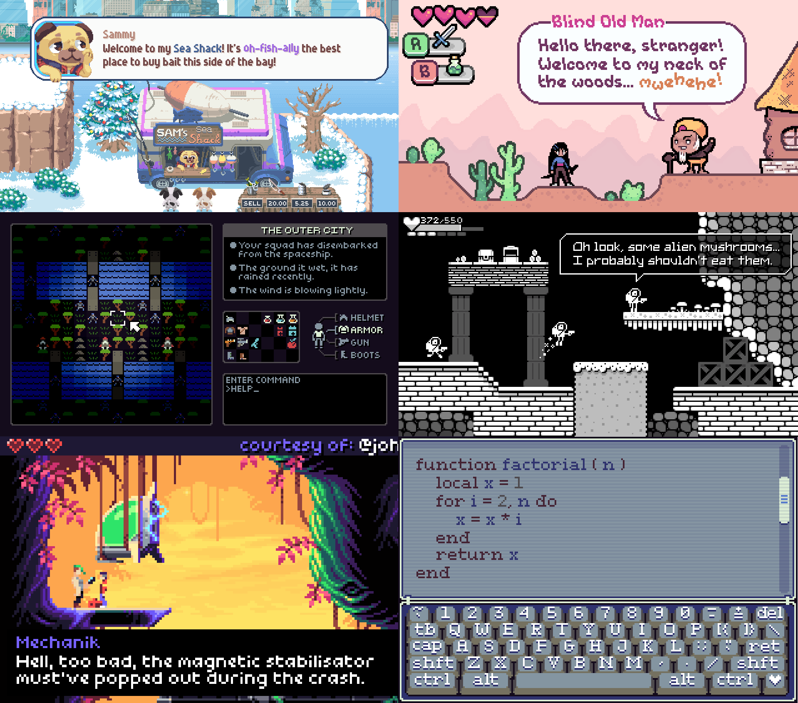
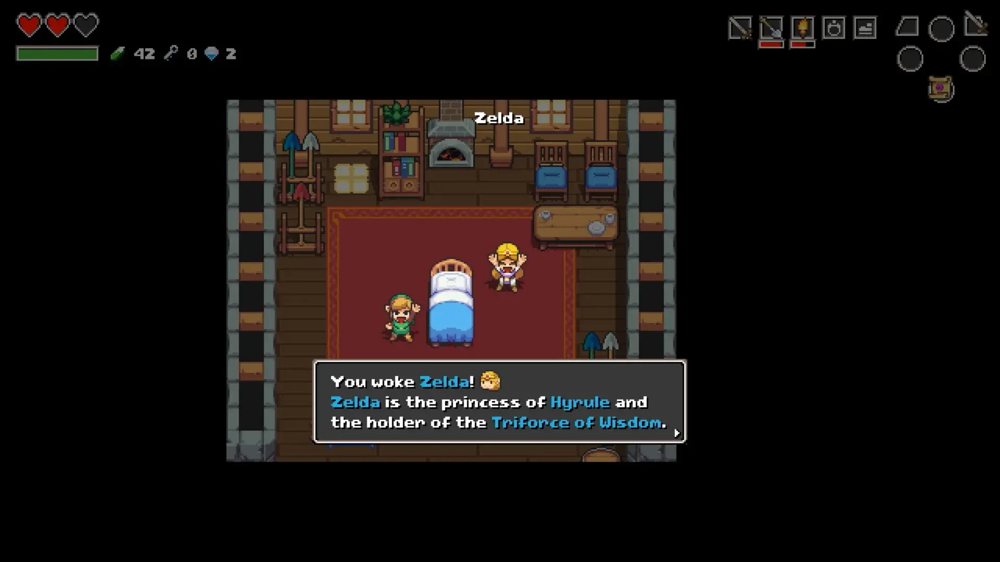
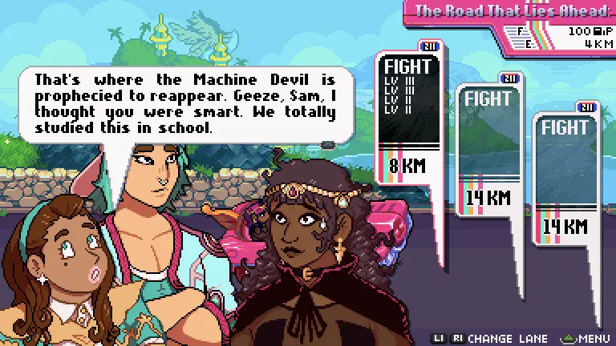
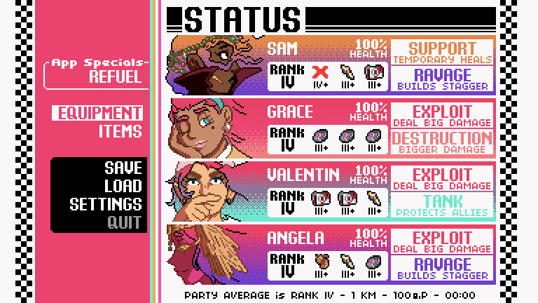
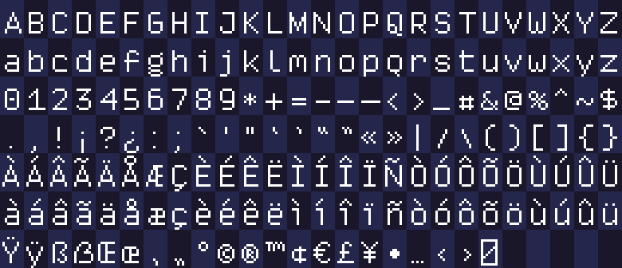
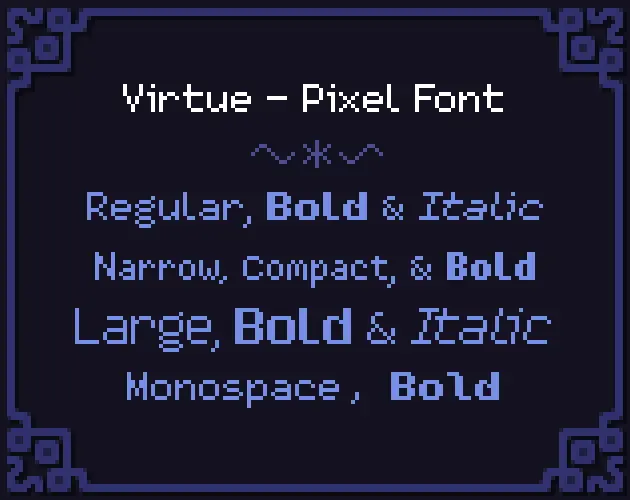
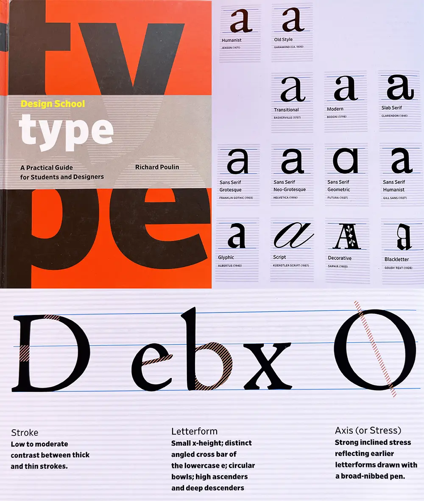
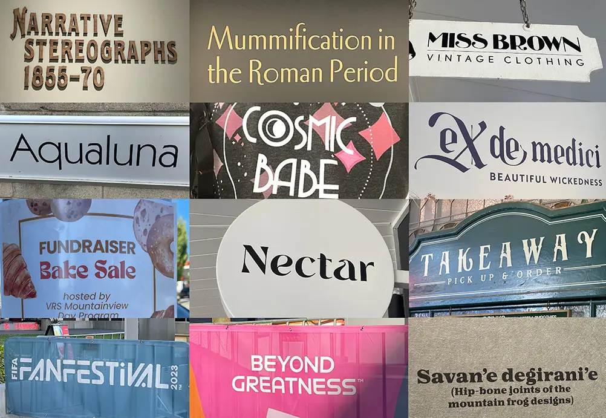

+++
title = "Shipping 175 Pixel Fonts"
slug = "shipping-175-pixel-fonts"
description = "The tools I made to create and ship 175 pixel fonts."
draft = true

[taxonomies]
tags = ["meta"]

[extra]
has_toc = true
+++

In December of 2023 I launched the *175 Pixel Font Megapack*, followed shortly by 42 individual packs
for each font family. I created my own toolchain for generating, quality testing, and deploying
these fonts... in Rust! In this post I'll showcase how my pixel fonts come to be.

<!-- more -->

<iframe src="https://www.youtube.com/embed/45Ylt2FLJxI?si=OiOEpCiwmvT3_Rft" title="YouTube video player" frameborder="0" allow="accelerometer; autoplay; clipboard-write; encrypted-media; gyroscope; picture-in-picture; web-share" referrerpolicy="strict-origin-when-cross-origin" allowfullscreen></iframe>

Check out the [Pixel Font Megapack](https://chevyray.itch.io/pixel-font-megapack) on itch.io!

## Before the Megapack

Before we talk about the new pack, let's talk about the old packs.

### The First Pack

Back in 2016, while I was starting work on [Ikenfell](https://www.humblegames.com/games/ikenfell/),
I was strapped for cash. I'd been making fonts for my games for awhile now, including 2 new ones for
Ikenfell, and so I polished them up, created a few more, and sold 12 of them together as a pack on
itch.io.



These were *fine*. I've improved at font design tremendously since then, and so they're awful for me to
look at now, but people liked them and they ended up being used in a bunch of indie games at the time.

### The Second Pack

Since the response was positive, and the supplementary income was helping, I decided to do another pack
two years later in 2018. This time, the font quality was bumped up a lot. I spent more time on the fonts,
created kerning tables for them so they would render sentences better, and made them available in different
pre-baked formats for different engines. I'd also just improved as a font designer.



I also spent a lot more time and work promoting these. I also reached out to several indie devs who were
making pixel art games at the time and asked if I could use screenshots of their games but replace the
fonts with mine, as a way to demonstrate them in action. I combined those with a few mockups of my own
of fake games.

<figure>
    
    <figcaption>The amount of people who asked me where they could find some of these fake games...</figcaption>
<figure>

### Legacy

The pack was very popular and a financial savior for me, and I think these mockups helped a lot. They've
been used in hundreds of indie games, even in big games like Nintendo's [Cadence of Hyrule](https://www.nintendo.com/en-ca/store/products/cadence-of-hyrule-crypt-of-the-necrodancer-featuring-the-legend-of-zelda-switch/), created
by local developer [Brace Yourself Games](https://braceyourselfgames.com/).

<figure>
    
    <figcaption>Seeing my fonts in a Zelda game, even if a spin-off, was motivating to say the least.</figcaption>
<figure>

Another one of my favorites was [Get in the Car, Loser](https://loveconquersallgames.itch.io/getinthecarloser),
by [Love Conquers All Games](https://loveconquersallgam.es/), which made great use of several of the fonts.

<figure>
    
    
    <figcaption>The writing in this game never fails to crack me up.</figcaption>
<figure>

I was very happy with these results, so it was only a matter of time before I decided to revisit pixel
fonts.

## Goals for the Megapack

After Ikenfell released, I was in pretty bad burnout for a long time and did not yet have the energy to
work on another game. During that time, I continued to learn and improve my Rust programming skills. I
also kept dabbling in pixel fonts, with the intent of eventually putting together another pack.

But I knew I'd have to outdo the previous back, and I planned to do so definitively.

### Bigger and Better

The first pack had 12 fonts and the second pack had 40 fonts, and this time I was determined to make a
pack of... *one hundred fonts*! Not only that, but I also wanted to bump up the quality. I wanted more
variety, fonts that could be used for sci-fi games, fantasy games, horror games, farming games, cozy
games, and so on.

I wanted to make the *definitive* pixel font pack.

### More Language Support

The largest request (and sometimes complaint) with the previous packs is that they only had support for
[ASCII](https://en.wikipedia.org/wiki/ASCII) characters. This was stated clearly on the page, but
unfortunately a lot of people don't actually know what *ASCII* is and conflate it with just plain text.

There was no accented characters, meaning language support for the game was very limited. So this time
around I chose to extend the latin character set to fully support "EFIGS" (English, French, Italian,
German, and Spanish). Accented characters also appear in English from time to time, (eg. "touché!") so
this would still improve support for unlocalized games.

<figure>
    
    <figcaption>The final character set I settled on.</figcaption>
<figure>

I decided not to support any Asian or non-Latin based languages because I am not as familiar with those
character sets and not only would I not be able to achieve the quality I wanted, but it would also make
the fonts take an order of magnitude longer to create. I would still like to create a pixel font family
some day that has support for many, many more languages.

### Style Variations

One thing I noticed with the 40-pack was that people would mix and match the fonts a lot. Games often
have a lot of UI, and good UI requires a lot of visual hierarchy. If all the text is the same size
and weight, it's hard to make something stand out or recede, and readability suffers. This is more
difficult with pixel fonts than regular fonts because they are not vectors and do not scale smoothly.

So this time around, I didn't just want a big variety of fonts, I also wanted each font to be a
*family* of styles supporting different sizes and weights. So for example, the
[Virtue](https://chevyray.itch.io/pixel-font-virtue) font family comes with a whopping 20 styles!



This way, rather than mixing fonts with completely different styles to add variation, developers
could have the variation they wanted while remaining stylistically cohesive.

### Kerning Completeness

Kerning was a big time hog when making my previous font packs. Because the tools I was using
required every kerning pair to be manually entered, it was incredibly time consuming and also
extremely error prone.

Look at it this way&mdash;if I have just three characters `A B C`, these are the following potential
kerning pairs: `AA`, `AB`, `AC`, `BA`, `BB`, `BC`, `CA`, `CB`, and `CC`. That's 9 total entries! In
fact, you can calculate how many entries you (may) need by just squaring the amount of characters you
support.

My new fonts were going to support 176 characters, meaning I might have to enter as many as
`176² = 37,976` kerning pairs... yeah not going to happen. So this time, since I was (spoiler alert)
writing my own tool to generate the fonts, I decided to semi-automate this process to take care of
a huge majority of the kerning, and do manual entry when algorithm didn't suffice.

### Better Quality Control

With definitely only a hundred (*shh... he doesn't know yet*) fonts in the oven, managing them all
was going to be a significant task. With the previous font packs, I did it manually. If I found a
stray pixel or a bug in the kerning I would fix it, re-export the font, test that the re-export
worked and the error was gone, and then re-upload the assets to itch manually.

Also, I just couldn't evaluate the overall quality of the fonts easily. So this time, I wanted to
have a way to generate big sample texts of the font and visualizations of kerning pairs so that as
I was working on the fonts I could preview them, easily spot problems, and see my fixes immediately.

### Easier Deployment &amp; Maintenance

Making kerning and quality control faster and more automated lead to the obvious conclusion that I
should also make the entire upload/deployment process automated as well. My goal was to have it so
that adding improvements the fonts, fixing errors, and creating new ones in the future would be
simple, painless, reliable, and automatic and error-proof as possible.

## Raising the Bar

While my previous fonts were well-received and decent quality, if I wanted to produce something that
was much more impressive, I had to sit down and improve.

### Studying Font Design

I've been a pixel artist since I was a wee child, and made a lot of pixel fonts, but I hadn't actually
*studied* typeface design before. Ultimately, I was fairly ignorant when it came to both the history
and the nature of traditional typeface design. So while I was working on these fonts, I spent a lot of
time studying and learning as much as I could about the craft.

A book that helped me a lot, and I think is great for beginners, is the book
[Design School: Type](https://www.richardpoulin.net/books/design-school-type) by Richard Poulin.



This was a great guide for beginners and acts as a comprehensive dictionary for the huge amount
of terminology and conventions that exist in typeface design.

### Photo References

Another thing I did was started taking and saving photos of text I saw out in the world. I found small
shop signs, museums, art galleries, festivals, posters for local events, and book covers to be amazing
sources of inspiration. Here's a tiny sample of photos from my reference folder:



These are not for copying, but rather for studying. Look at some of these shapes, how some of the letters
hang below the baseline, how certain letters are really thin while others are wide.

One of my biggest takeaways from studying a lot of amazing fonts out in the wild is the realization that
most "fancy" fonts actually don't go too crazy with all their letters. Usually fanciness is reserved for
capital letters, and lowercase letters often get more subtle flair, with the occasional letter that
jumps out at you.

## PIFO: My Pixel Font Tool

To achieve these lofty goals, and because I wanted to and nobody could stop me, I wrote my own Rust program
for creating pixel fonts: `pifo`!

### How It Works

I like using my normal pixel art tools to actually design the fonts. When I make a font, I produce a tile
sheet that looks like this:


Combined with a config file with some settings to guide the tool:

> TOML
```toml
version = "1.0"          # font version
baseline = 14            # baseline from the top of a tile
line_gap = 0             # gap between vertical lines of text
spacing = 3              # width of space character
metrics = []             # manually assign metrics for glyphs
auto_kerning = true      # enable automatic kerning
auto_kerning_min = -1    # never kern farther than 1 pixel left
manual_kerning = []      # manually kern specific glyph pairs
skip_kerning_left = ""   # don't kern when these glyphs are the L-pair
skip_kerning_right = ""  # don't kern when these glyphs are the R-pair
```

It then takes the image, chops it up into individual glyph tiles, generates contours for
them, automatically calculates kerning pairs between them, and then gathers them all
into a font and exports as a TTF file.

It then also exports

All the work done on individual glyphs is parallelized, making it almost instant for a
single font. Running this process on 175 fonts one-by-one takes only a couple of seconds.
If these processes were to run in parallel, it would be almost instant again.

### Crates Used


## Step 1: Creating Font Sheets

## Step 2: Contouring Glyphs

### Gathering the Pixels

### Detecting Clusters

### Creating the Edge List

### Chaining Edges

### Removing Edge Vertices

## Step 3: Kerning Tables

### Manual Kerning &amp; Alts

### Automatic Kerning

## Exporting

### TrueType Files

### Tile Sheets

### Packed Atlases

## Quality Testing

## Deployment

### Creating itch.io Projects

### Building &amp; Uploading