+++
title = "How I Created 175 Fonts Using Rust"
slug = "creating-175-fonts"
description = "How I used my own Rust tool to ship 175 quality pixel fonts."
draft = false

[taxonomies]
tags = ["rust"]

[extra]
has_toc = true
+++

In December of 2023 I launched the *175 Pixel Font Megapack*, followed shortly by 42 individual packs
for each font family. I created my own toolchain for generating, quality testing, and deploying
these fonts... in Rust! In this post I'll walk you through the whole process.

<!-- more -->

<iframe src="https://www.youtube.com/embed/45Ylt2FLJxI?si=OiOEpCiwmvT3_Rft" title="YouTube video player" frameborder="0" allow="accelerometer; autoplay; clipboard-write; encrypted-media; gyroscope; picture-in-picture; web-share" referrerpolicy="strict-origin-when-cross-origin" allowfullscreen></iframe>

Check out the [Pixel Font Megapack](https://chevyray.itch.io/pixel-font-megapack) on itch.io!

## Before the Megapack

Before we talk about the new pack, let's talk about the old packs.

### The First Pack

Back in 2016, while I was starting work on [Ikenfell](https://www.humblegames.com/games/ikenfell/),
I was strapped for cash. I'd been making fonts for my games for awhile now, including 2 new ones for
Ikenfell, and so I polished them up, created a few more, and sold 12 of them together as a pack on
itch.io.


These were *fine*. I've improved at font design tremendously since then, and so they're awful for me to
look at now, but people liked them and they ended up being used in a bunch of indie games at the time.

### The Second Pack

Since the response was positive, and the supplementary income was helping, I decided to do another pack
two years later in 2018. This time, the font quality was bumped up a lot. I spent more time on the fonts,
created kerning tables for them so they would render sentences better, and made them available in different
pre-baked formats for different engines. I'd also just improved as a font designer.


I also spent a lot more time and work promoting these. I also reached out to several indie devs who were
making pixel art games at the time and asked if I could use screenshots of their games but replace the
fonts with mine, as a way to demonstrate them in action. I combined those with a few mockups of my own
of fake games.

<figure>
    
    <figcaption>The amount of people who asked me where they could find some of these fake games...</figcaption>
</figure>

### Legacy

The pack was very popular and a financial savior for me, and I think these mockups helped a lot. They've
been used in hundreds of indie games, even in big games like Nintendo's [Cadence of Hyrule](https://www.nintendo.com/en-ca/store/products/cadence-of-hyrule-crypt-of-the-necrodancer-featuring-the-legend-of-zelda-switch/), created
by local developer [Brace Yourself Games](https://braceyourselfgames.com/).

<figure>
    
    <figcaption>Seeing my fonts in a Zelda game, even if a spin-off, was motivating to say the least.</figcaption>
</figure>

Another one of my favorites was [Get in the Car, Loser](https://loveconquersallgames.itch.io/getinthecarloser),
by [Love Conquers All Games](https://loveconquersallgam.es/), which made great use of several of the fonts.

<figure>
    
    
    <figcaption>The writing in this game never fails to crack me up.</figcaption>
</figure>

I was very happy with these results, so it was only a matter of time before I decided to revisit pixel
fonts.

## Goals for the Megapack

After Ikenfell released, I was in pretty bad burnout for a long time and did not yet have the energy to
work on another game. During that time, I continued to learn and improve my Rust programming skills. I
also kept dabbling in pixel fonts, with the intent of eventually putting together another pack.

But I knew I'd have to outdo the previous pack, and I planned to do so definitively.

### Bigger and Better

The first pack had 12 fonts and the second pack had 40 fonts, and this time I was determined to make a
pack of... *one hundred fonts*! Not only that, but I also wanted to bump up the quality. I wanted more
variety, fonts that could be used for sci-fi games, fantasy games, horror games, farming games, cozy
games, and so on.

I wanted to make the *definitive* pixel font pack.

### More Language Support

The largest request (and sometimes complaint) with the previous packs is that they only had support for
[ASCII](https://en.wikipedia.org/wiki/ASCII) characters. This was stated clearly on the page, but
unfortunately a lot of people don't actually know what *ASCII* is and conflate it with just plain text.

There was no accented characters, meaning language support for the game was very limited. So this time
around I chose to extend the latin character set to fully support "EFIGS" (English, French, Italian,
German, and Spanish). Accented characters also appear in English from time to time, (eg. "touché!") so
this would still improve support for unlocalized games.

<figure>
    
    <figcaption>The final character set I settled on.</figcaption>
</figure>

I decided not to support any Asian or non-Latin based languages because I am not as familiar with those
character sets and not only would I not be able to achieve the quality I wanted, but it would also make
the fonts take an order of magnitude longer to create. I would still like to create a pixel font family
some day that has support for many, many more languages.

### Style Variations

One thing I noticed with the 40-pack was that people would mix and match the fonts a lot. Games often
have a lot of UI, and good UI requires a lot of visual hierarchy. If all the text is the same size
and weight, it's hard to make something stand out or recede, and readability suffers. This is more
difficult with pixel fonts than regular fonts because they are not vectors and do not scale smoothly.

So this time around, I didn't just want a big variety of fonts, I also wanted each font to be a
*family* of styles supporting different sizes and weights. So for example, the
[Virtue](https://chevyray.itch.io/pixel-font-virtue) font family comes with a whopping 20 styles!


This way, rather than mixing fonts with completely different styles to add variation, developers
could have the variation they wanted while remaining stylistically cohesive.

### Kerning Completeness

Kerning was a big time hog when making my previous font packs. Because the tools I was using
required every kerning pair to be manually entered, it was incredibly time consuming and also
extremely error prone.

Look at it this way&mdash;if I have just three characters `A B C`, these are the following potential
kerning pairs: `AA`, `AB`, `AC`, `BA`, `BB`, `BC`, `CA`, `CB`, and `CC`. That's 9 total entries! In
fact, you can calculate how many entries you (may) need by just squaring the amount of characters you
support.

My new fonts were going to support 176 characters, meaning I might have to enter as many as
`176² = 37,976` kerning pairs... yeah not going to happen. So this time, since I was (spoiler alert)
writing my own tool to generate the fonts, I decided to semi-automate this process to take care of
a huge majority of the kerning, and do manual entry when the algorithm didn't suffice.

### Better Quality Control

With definitely only a hundred (*shh... he doesn't know yet*) fonts in the oven, managing them all
was going to be a significant task. With the previous font packs, I did it manually. If I found a
stray pixel or a bug in the kerning I would fix it, re-export the font, test that the re-export
worked and the error was gone, and then re-upload the assets to itch manually.

Also, I just couldn't evaluate the overall quality of the fonts easily. So this time, I wanted to
have a way to generate big sample texts of the font and visualizations of kerning pairs so that as
I was working on the fonts I could preview them, easily spot problems, and see my fixes immediately.

### Easier Deployment &amp; Maintenance

Making kerning and quality control faster and more automated lead to the obvious conclusion that I
should also make the entire upload/deployment process automated as well. My goal was to have it so
that adding improvements the fonts, fixing errors, and creating new ones in the future would be
simple, painless, reliable, and automatic and error-proof as possible.

## Raising the Bar

While my previous fonts were well-received and decent quality, if I wanted to produce something that
was much more impressive, I had to sit down and improve.

### Studying Font Design

I've been a pixel artist since I was a wee child, and made a lot of pixel fonts, but I hadn't actually
*studied* typeface design before. Ultimately, I was fairly ignorant when it came to both the history
and the nature of traditional typeface design. So while I was working on these fonts, I spent a lot of
time studying and learning as much as I could about the craft.

A book that helped me a lot was
[Design School: Type](https://www.richardpoulin.net/books/design-school-type) by Richard Poulin.


This was a great guide for beginners and acts as a comprehensive dictionary for the huge amount
of terminology and conventions that exist in typeface design.

### Photo References

Another thing I did was started taking and saving photos of text I saw out in the world. I found small
shop signs, museums, art galleries, festivals, posters for local events, and book covers to be amazing
sources of inspiration. Here's a tiny sample of photos from my reference folder:

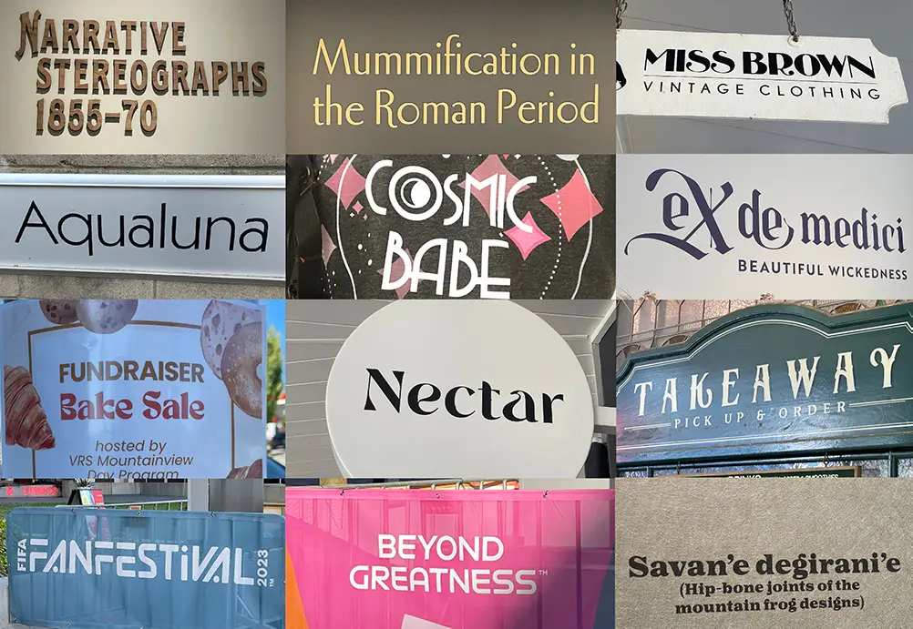

These are not for copying, but rather for studying. Look at some of these shapes, how some of the letters
hang below the baseline, how certain letters are really thin while others are wide.

One of my biggest takeaways from studying a lot of amazing fonts out in the wild is the realization that
most "fancy" fonts actually don't go too crazy with all their letters. Usually fanciness is reserved for
capital letters, and lowercase letters often get more subtle flair, with the occasional letter that
jumps out at you.

## PIFO: My Pixel Font Tool

To achieve these lofty goals, and because I wanted to and nobody could stop me, I wrote my own Rust program
for creating pixel fonts: `pifo`!

### How It Works

I like using my normal pixel art tools to actually design the fonts. When I make a font, I produce a PNG
tilesheet and a config file to provide some metrics and settings to guide the tool. I can then feed these
files into `pifo`:

```bat
pifo --all --output "Faraway" --input "Faraway*"
```

It then takes the image, chops it up into individual glyph tiles, generates contours for
them, automatically calculates kerning pairs between them, and then gathers them all
into a font and exports as a TTF file. It also exports the font in several other
engine-ready formats.

All the work done on individual glyphs is parallelized, making it almost instant for a
single font. Running this process on 175 fonts one-by-one takes only a couple of seconds.
If these processes were to run in parallel, it would be almost instant again.

### Crates Used

I didn't need too many special crates for this, but the ones I used were very helpful.

- [clap](https://crates.io/crates/clap) for command line argument parsing
- [image](https://crates.io/crates/image) for image decoding and encoding
- [rayon](https://crates.io/crates/rayon) for parallellization
- [serde](https://crates.io/crates/serde) for data serialization
- [glyph-names](https://crates.io/crates/glyph-names) which maps char to glyph names
- [ab-glyph](https://crates.io/crates/ab_glyph) for loading and rasterizing fonts
- [crunch](https://crates.io/crates/crunch) for rectangle packing

## Step 1: Creating Font Sheets

Every font sheet has a tilesheet and config file that look like this:

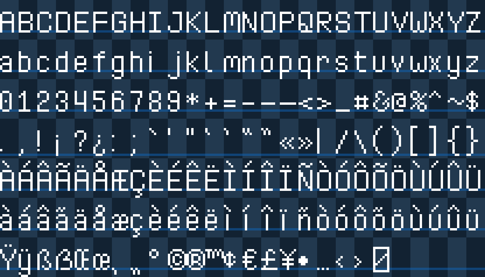

> TOML
```toml
version = "1.0"          # font version
baseline = 14            # baseline from the top of a tile
line_gap = 0             # gap between vertical lines of text
spacing = 3              # width of space character
metrics = []             # manually assign metrics for glyphs
auto_kerning = true      # enable automatic kerning
auto_kerning_min = -1    # never kern farther than 1 pixel left
manual_kerning = []      # manually kern specific glyph pairs
skip_kerning_left = ""   # don't kern when these glyphs are the L-pair
skip_kerning_right = ""  # don't kern when these glyphs are the R-pair
```

The grid size can change, but it must always be a uniform grid and the characters
must always be in those positions. Only 100% white pixels will be processed by the
tool, so the checkered background and baseline are merely guides that will be
discarded when the sheet is processed.

## Step 2: Contouring Glyphs

Once the sheet is ready, contouring can begin. This is the most complex part of the
process, and so I'll go over all the steps of the algorithm here.

TrueType glyphs are created out of one or multiple *contours*, which are basically
closed shapes made out of curves. So for example, the letter `i` would be one
contour for the dot, and a second contour for the rest of the shape.

Because our fonts are pixel fonts, we need to create a contour for every connected
group (or "cluster") of pixels. Using this lowercase `t` as an example, we need
the algorithm to turn it from pixels into two contours
<span class="red">**`A`**</span> and <span class="blue">**`B`**</span> like so:

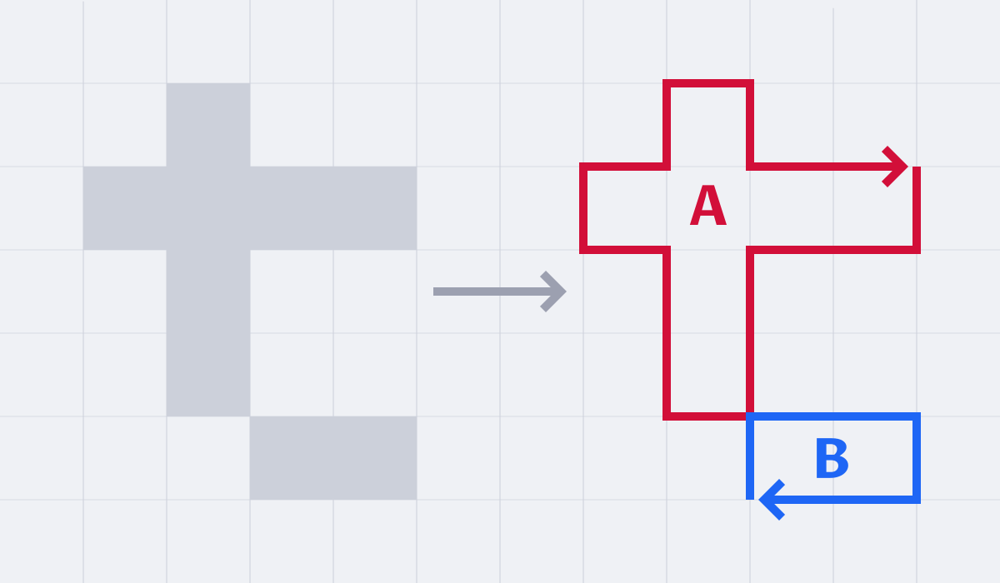

It doesn't matter where the contour begins and ends, as long as it's a closed loop.

### Gathering the Pixels

Starting with the glyph's image, we first need to separate out all the pixels of the
bitmap, because that's all we'll really be operating on. Rather than working with
the image directly, I found it easier to write the algorithms by working with
collections of `Point` structs which look like this:

> Rust code
```rust
// these have a bunch of derives, methods, and
// constructors, but I won't list them all here
#[derive]
pub struct Point {
    pub x: i16,
    pub y: i16,
}

impl Point {
    fn new(x: i16, y: i16) -> Self {
        Self { x, y }
    }

    fn right(&self) -> Self {
        Self::new(self.x + 1, self.y)
    }

    fn left(&self) -> Self {
        Self::new(self.x - 1, self.y)
    }

    fn below(&self) -> Self {
        Self::new(self.x, self.y + 1)
    }

    fn above(&self) -> Self {
        Self::new(self.x, self.y - 1)
    }

    fn left_edge(&self) -> (Point, Point) {
        (Self::new(self.x, self.y + 1), Self::new(self.x, self.y))
    }

    fn right_edge(&self) -> (Point, Point) {
        (
            Self::new(self.x + 1, self.y),
            Self::new(self.x + 1, self.y + 1),
        )
    }

    fn top_edge(&self) -> (Point, Point) {
        (Self::new(self.x, self.y), Self::new(self.x + 1, self.y))
    }

    fn bottom_edge(&self) -> (Point, Point) {
        (
            Self::new(self.x + 1, self.y + 1),
            Self::new(self.x, self.y + 1),
        )
    }

    pub fn sign(self) -> Self {
        Self::new(self.x.signum(), self.y.signum())
    }
}
```

Given an [`RgbaImage`](https://docs.rs/image/latest/image/type.RgbaImage.html), we can
collect all the white pixels into a `HashSet`:

> Rust code
```rust
const WHITE: Rgba<u8> = Rgba([255; 4]);
let pixels: HashSet<Point> = img
    .enumerate_pixels()
    .filter(|(_, _, p)| *p == &WHITE)
    .map(|(x, y, _)| Point::new(x as i16, y as i16))
    .collect();
```

### Detecting Clusters

Now we need to group these pixels together into clusters so we can operate on and
create a contour for them separately. So for our letter, we can identify that it
should have two clusters.

To do this we start by choosing a random pixel and "flood filling" it, spreading out
into every adjacent pixel until there are no more it can spread to, and then that
produces a single cluster. Then, we take the remaining pixels and repeat again,
continuing this loop until there are no more unvisited pixels.

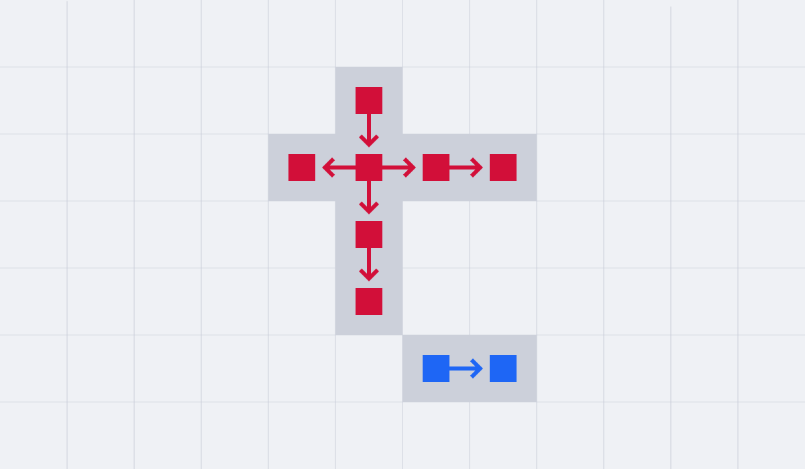

The following algorithm does so:

> Rust code
```rust
// generate a list of "clusters" of pixels that are connected together
let mut clusters: Vec<HashSet<Point>> = Vec::new();
{
    // to find clusters, we flood-fill pixels in the image,
    // removing them, until there are none left
    let mut pixels = pixels.clone();
    let mut to_process = Vec::new();

    // while there are pixels left
    while let Some(&p) = pixels.iter().next() {
        // add the pixel to the process list
        to_process.push(p);

        // create a new cluster
        let mut cluster = HashSet::new();

        // while there are pixels to be processed
        while let Some(p) = to_process.pop() {
            // remove the pixel and add it to the cluster
            pixels.remove(&p);
            cluster.insert(p);

            // queue processing for all adjacent pixels
            // that have not yet been processed
            to_process.extend(p
                .adjacent()
                .into_iter()
                .filter(|p| pixels.contains(p))
            );
        }

        clusters.push(cluster);
    }
}
```

### Creating the Edge List

Now we have our clusters, each which represents one "shape" made out of contours. We now need
to find the *outline* of each of them because that's what we'll be creating the contours out of.

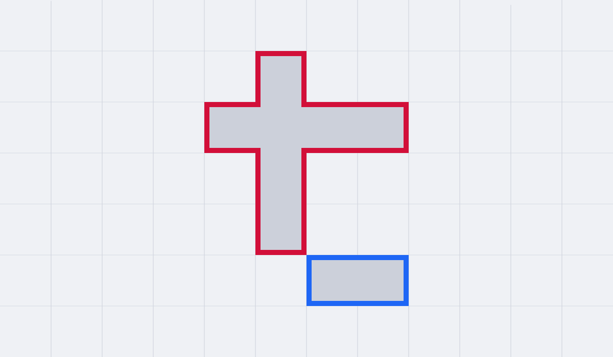

To do this, we first make a list of all the exposed edges of all pixels, where "exposed" means
there is no adjacent pixel on that side. Just looking at one cluster, it looks like this:

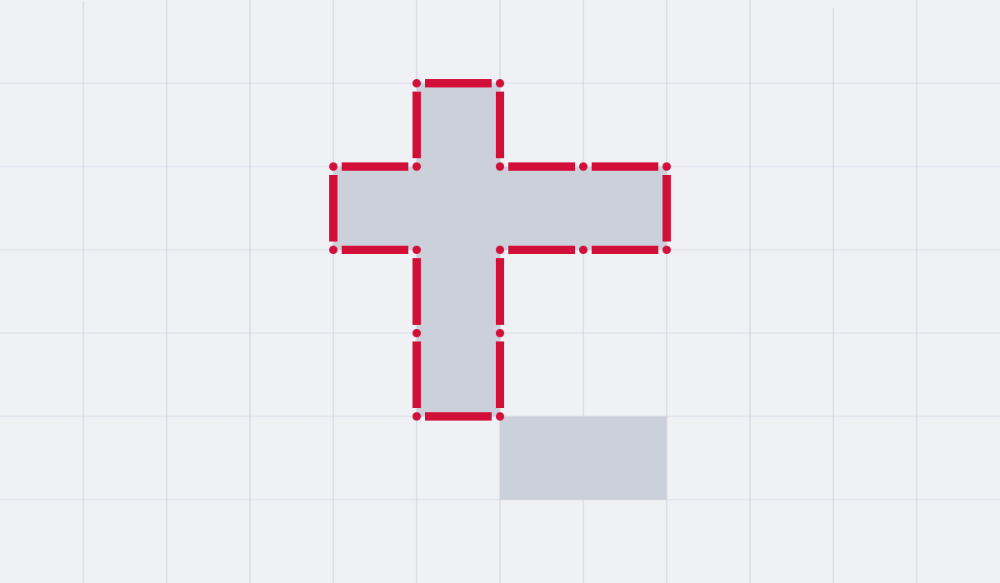

The code to create this list of edges:

> Rust code
```rust
let mut edges: Vec<(Point, Point)> = cluster
    .iter()
    .map(|p| {
        [
            (!cluster.contains(&p.above())).then(|| p.top_edge()),
            (!cluster.contains(&p.right())).then(|| p.right_edge()),
            (!cluster.contains(&p.below())).then(|| p.bottom_edge()),
            (!cluster.contains(&p.left())).then(|| p.left_edge()),
        ]
    })
    .flatten()
    .flatten()
    .collect();
```

### Chaining Edges

The next part is tricky. We need to take that list of edges and build a *path* out
of them by attaching them together. If we imagine each edge as a `(tail, head)`
tuple of points, then we can write an algorithm that attaches all the
overlapping heads to all the overlapping tails to create a contiguous path.

> Rust code
```rust
// each cluster will generate one or more contours
let mut contours: Vec<Vec<Point>> = Vec::new();

// if we have edges remaining, start a new path
while let Some((a, b)) = edges.pop() {
    // the contour starts with the first edge
    let mut contour = vec![a, b];
    let mut end = b;
    let mut i = 0;

    while i < edges.len() {
        // check the portion after the last edge for a chain
        if let Some((j, (_, b))) = edges[i..]
            .iter()
            .cloned()
            .enumerate()
            .find(|(_, (a, _))| a == &end)
        {
            edges.remove(i + j);
            contour.push(b);
            end = b;
            i += j;
            if i >= edges.len() {
                i -= edges.len();
            }
            continue;
        }

        // check the portion before the last edge for a chain
        if let Some((j, (_, b))) = edges[..i]
            .iter()
            .cloned()
            .enumerate()
            .find(|(_, (a, _))| a == &end)
        {
            edges.remove(j);
            contour.push(b);
            end = b;
            i = j;
            if i >= edges.len() {
                i -= edges.len();
            }
            continue;
        }

        break;
    }

    // the end point is the same as the start point
    contour.pop();

    // add it to our contour list
    contours.push(contour);
}
```

This will create the following contour from the cluster:

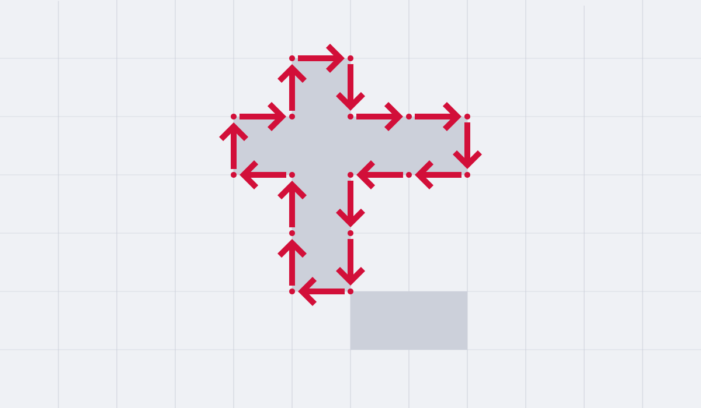

You may have noticed that this code assumes that each cluster can produce multiple
contours. This is because if you have a cluster with a hole in the middle, that
will in fact be the case:

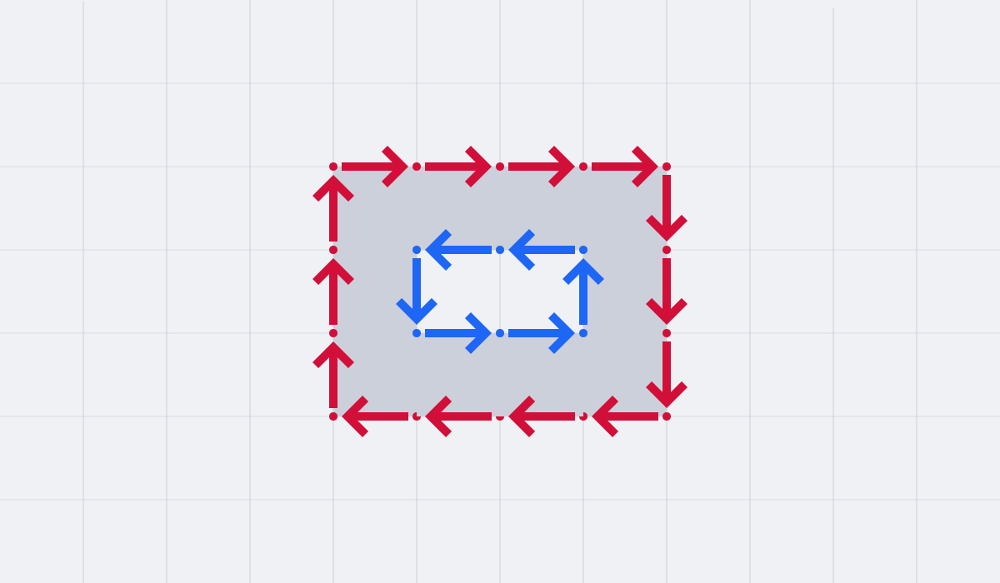

Also notice that whenever we have clusters with holes, the winding of the outside of the
cluster is clockwise, but the winding of the holes is counter-clockwise. This is an artifact of how
edges are provided in clockwise order, and is actually very lucky because that's exactly how TTF
contours work! When you want to describe a hole in a glyph, you create an inner contour and wind it
in the opposite direction of the outer contour.

### Remove Non-Corner Points

While this will technically work, we can optimize this a bit more. When multiple edges
connect in a line, we don't really need them all, do we? If we remove all non-corner
points, we can shrink the file size and also increase rasterization speed.

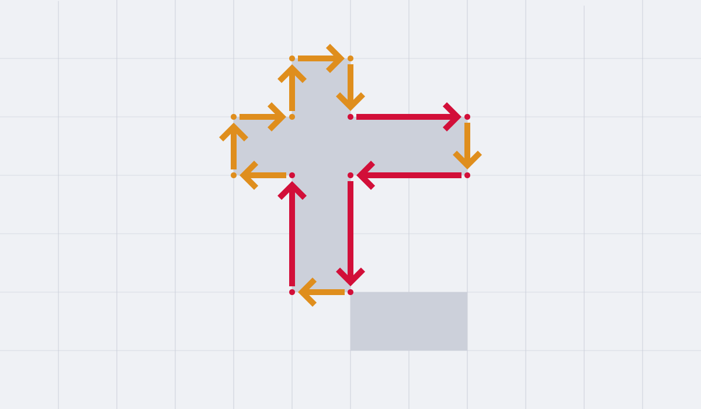

We do this after chaining, right before adding our contour to the list:

> Rust code
```rust
// for every a→b→c sequence of points, if the normal of a→b is equal
// to the normal of b→c, then we can remove b and link a→c directly
let mut i = 1;
while i <= contour.len() {
    let a = contour[i - 1];
    let b = contour[i % contour.len()];
    let c = contour[(i + 1) % contour.len()];
    if (b - a).sign() == (c - b).sign() {
        contour.remove(i % contour.len());
    } else {
        i += 1;
    }
}

// *now* we can add it to our contour list
contours.push(contour);
```

## Step 3: Kerning Tables

Once we have the contours done, we only need one more thing in order to produce our
TTF file: kerning tables. This table tells fonts when they are allowed to shift
characters left to fit words together more tightly.

<figure>
    
    <figcaption>Shifting the <b>Va</b> and the <b>lt</b> pairs left by just one pixel looks a lot nicer.</figcaption>
</figure>

### Manual Kerning &amp; Alts

Kerning can be manually assigned in the font's `TOML` file. So for the kerning pairs in
the example above, we could do this:

> TOML
```toml
manual_kerning = [
    { left = "V", right = "a", kern = -1 },
    { left = "l", right = "t", kern = -1 },
]
```

But our fonts also support accents, so for the letter `a` we would have to consider all
its accented variations..

> TOML
```toml
manual_kerning = [
    { left = "V", right = "a", kern = -1 },
    { left = "V", right = "à", kern = -1 },
    { left = "V", right = "á", kern = -1 },
    { left = "V", right = "â", kern = -1 },
    # ...etc.
```

To simplify this, I can use the `alts` parameter to achieve the same thing:

> TOML
```toml
manual_kerning = [
    { left = "V", right = "a", kern = -1, alts = true }
]
```

This is the map used to identify a character's alts:

> Rust code
```rust
// for manual kerning, copy settings for alts/diacritics
let alt: HashMap<char, &'static str> = HashMap::from_iter([
    ('A', "ÀÁÂÃÄÅ"),
    ('a', "àáâãäå"),
    ('C', "Ç"),
    ('c', "ç"),
    ('E', "ÈÉÊË"),
    ('e', "èéêë"),
    ('I', "ÌÍÎÏ"),
    ('I', "ÌÍÎÏ"),
    ('i', "ìíîï"),
    ('N', "Ñ"),
    ('n', "ñ"),
    ('O', "ÒÓÔÕÖ"),
    ('o', "òóôõö"),
    ('U', "ÙÚÛÜ"),
    ('u', "ùúûü"),
    ('Y', "Ÿ"),
    ('y', "ÿ"),
]);
```

### Automatic Kerning

But manually entering thousands of kerning values is exactly what I wanted to
avoid. Instead, most kerning pairs will be automatically calculated, and the
manual system is to override the automatic system when it doesn't suffice.

So how do we find a kerning offset for a pair of letters? Let's use `LV` as
an example.


To figure out their kerning value, we have to move `V` to the left pixel-by-pixel
until it is as close to `L` as possible without touching it. So if we move it over
one pixel...

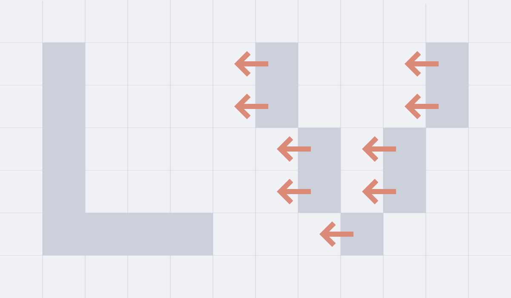

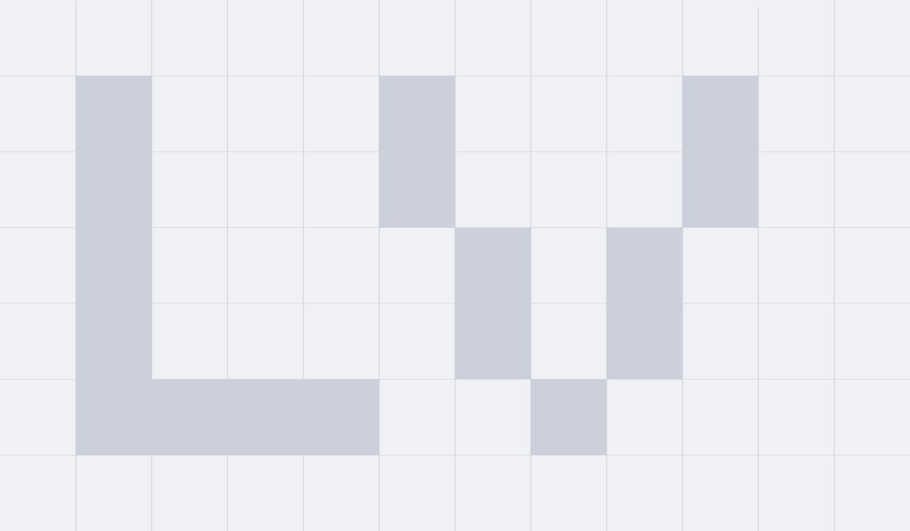

It's not touching, so a `-1` is good so far. What happens if we try moving it again?


Nope! Because two pixels are touching (corners touching counts), `-2` is too far, so
that means our calculated kerning for `LV` is `-1`!

The code to do this looks like so:

> Rust code
```rust
impl Point {
    fn surrounding(&self) -> [Self; 8] {
        let Point { x, y } = *self;
        [
            Self::new(x + 1, y),
            Self::new(x - 1, y),
            Self::new(x, y + 1),
            Self::new(x, y - 1),
            Self::new(x + 1, y + 1),
            Self::new(x - 1, y - 1),
            Self::new(x + 1, y - 1),
            Self::new(x - 1, y + 1),
        ]
    }
}

// calculate the kerning for this glyph and the right-hand glyph
pub fn calculate_kerning(
    left: &BitmapGlyph,
    right: &BitmapGlyph,
    min: i16
) -> Option<NonZero<i16>> {
    // the start position is 2 pixels after the first letter
    let mut kern: i16 = 0;
    let mut offset: i16 = left.max_pixel.x + 2;

    // if the left letter has no pixels blocking, we don't want
    // to kern into infinity so we stop at zero
    while offset > 0 && kern > min {
        offset -= 1;

        // translate every pixel in the right-side image by the offset
        // and then see if that shift would cause any pixels to touch
        if right
            .pixels
            .iter()
            .map(|p| Point::new(p.x + offset, p.y))
            .any(|p| {
                // after the pixel is translated, check all positions
                // surrounding it. if any of those positions touch any
                // pixels on the left glyph, we cannot kern here
                p.surrounding()
                    .iter()
                    .any(|adj| left.pixels.contains(adj))
            })
        {
            break;
        }

        // this shift was safe, so increment the kerning
        kern -= 1;
    }

    NonZero::new(kern)
}
```

Given our current manually assigned kerning list, we can now extend it with the
automatically calculated ones.

> Rust code
```rust
// ignore manually assigned kerning
let ignore: HashSet<(char, char)> = kerning
    .iter()
    .map(|k| (k.left, k.right))
    .collect();
let skip_left: HashSet<char> = desc
    .skip_kerning_left
    .chars()
    .collect();
let skip_right: HashSet<char> = desc
    .skip_kerning_right
    .chars()
    .collect();

// calculate automatic kerning
let min_kern = desc.auto_kerning_min.unwrap_or(i16::MIN);
kerning.par_extend(
    glyphs
        .par_iter()
        .filter(|left| !skip_left.contains(&left.chr))
        .map(|left| {
            glyphs
                .par_iter()
                .filter(|right| !skip_right.contains(&right.chr))
                .map(move |right| (left, right))
        })
        .flatten()
        .filter(|(left, right)| !ignore.contains(&(left.chr, right.chr)))
        .filter_map(|(left, right)| {
            calculate_kerning(left, right, min_kern)
                .map(|kern| {
                    KerningPair {
                        left: left.chr,
                        right: right.chr,
                        kern: kern.get(),
                        alts: None,
                    }
                })
        }),
);
```

I won't go over every line of this because it's interacting with several other parts
of the codebase, and kind of doing a lot. But basically it respects the ignore settings
in the font's TOML file, and also calculates all the kerning pairs in parallel using
[rayon](https://crates.io/crates/rayon).

With all the kerning calculated, we can now create the TTF files.

## Step 5: Exporting

PIFO doesn't just generate TTF files, it also exports the fonts as tile sheets and
packed texture atlases. With each of these, multiple data formats are provided, so
you can use whichever you prefer.

### TrueType Files

The [OpenType format](https://learn.microsoft.com/en-us/typography/opentype/spec/) is
pretty involved, and has a huge amount of features that I do not need for these fonts.

TTF files are binary files made up of a bunch of blocks of data, called "tables", that
each contain different information about the font. The font starts with a table directory
which provides the memory location for each table so that font parsers can easily jump
around to access the information they want.

My exporter populates the following tables:

| Table | Description |
| ----- | ----------- |
| `head` | Global font information |
| `hhea` | Horizontal layout information |
| `maxp` | Memory requirements |
| `OS/2` | OpenType font requirements |
| `hmtx` | Horizontal metrics |
| `cmap` | Maps characters to glyph index |
| `loca` | Maps index to `glyf` table location |
| `glyf` | Glyph data (contours) |
| `kern` | Kerning pairs |
| `name` | Strings for font, author, style, copyright, etc. |
| `post` | Required for valid TTF file |

I won't go over all of it here, but my code to write a table looks like this:

> Rust code
```rust
// `hmtx` table
data.begin_table(Tag::Hmtx);
{
    // longHorMetric - hMetrics[numberOfHMetrics]
    for g in &font.glyphs {
        // advanceWidth -  Advance width, in font design units.
        data.write_u16(px_to_un(g.adv as i16) as u16);

        // lsb - Glyph left side bearing, in font design units.
        data.write_i16(px_to_un(g.lsb));
    }
}
data.end_table();
```

Every table needs to record its position, length, and [checksum](https://learn.microsoft.com/en-us/typography/opentype/spec/otff#calculating-checksums), so `begin_table()` and `end_table()` help do this.

The `px_to_un()` function converts pixels to font units, and looks like this:

> Rust code
```rust
let fake_height = 16;
let units_per_em = (2048 / fake_height) * fake_height;
let scale = units_per_em / fake_height;
let px_to_un = |x: i16| x * scale;
```

Normal fonts can be displayed at any size because they're made of smooth curves, but
pixel fonts don't have that luxury because pixels are discrete and so you must always
render them at multiples of some base size or you'll get a *wobbling* effect that looks
really bad.

So I decided that the *base size* for all my fonts is just `16`, meaning that rendering
a pixel font at that size will always produce pixels that are exactly `1 px` in size.
When you want to scale up the text without wobbling, you can just draw text at multiples
of 16, so `32`, `48`, `64`, etc.

### Tile Sheets

Fonts are also exported as tile sheets. Unlike the input sheets that group characters of
similarity together, these sheets are ordered by their unicode codepoints:

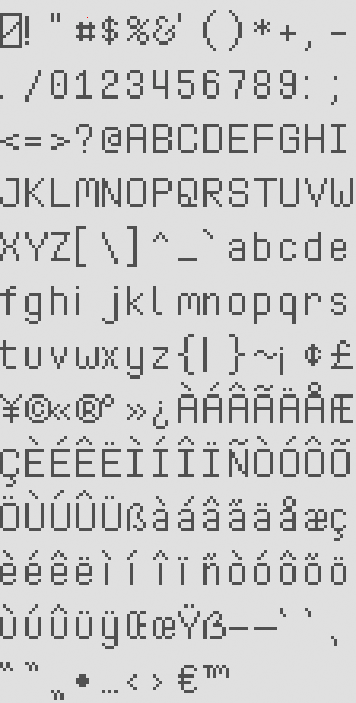

Each comes with a data file with font and glyph metrics:

> JSON
```json
{
  "cols": 14,
  "rows": 13,
  "tile_w": 8,
  "tile_h": 17,
  "baseline": 14,
  "line_gap": 0,
  "space_w": 3,
  "glyphs": [
        {
            "chr": "\u0000",
            "lsb": 0,
            "adv": 8
        },
        {
            "chr": "!",
            "lsb": 0,
            "adv": 2
        },
        {
            "chr": "\"",
            "lsb": 0,
            "adv": 4
        },
        {
            "chr": "#",
            "lsb": 0,
            "adv": 7
        },
```

This data file also contains a kerning table:

> JSON
```json
    "kerning": [
        {
            "left": "i",
            "right": "j",
            "kern": -3
        },
        {
            "left": "i",
            "right": "ì",
            "kern": -1
        },
        {
            "left": "j",
            "right": "j",
            "kern": -2
        },
```

To do this, I put this data into the following structs and use `serde` to serialize
them into the various supported formats (JSON, XML, TOML, etc).

> Rust code
```rust
#[derive(Debug, Serialize)]
struct Sheet {
    cols: u32,
    rows: u32,
    tile_w: u32,
    tile_h: u32,
    baseline: i16,
    line_gap: i16,
    space_w: i16,

    #[serde(skip_serializing_if = "Vec::is_empty", default)]
    glyphs: Vec<Glyph>,

    #[serde(skip_serializing_if = "Vec::is_empty", default)]
    kerning: Vec<KerningPair>,
}

#[derive(Debug, Serialize)]
struct Glyph {
    chr: char,
    lsb: i16,
    adv: i16,
}

#[derive(Debug, Serialize)]
struct KerningPair {
    left: char,
    right: char,
    kern: i16,
}
```

### Packed Atlases

Versions with the glyphs tightly packed into a texture atlas are also exported:

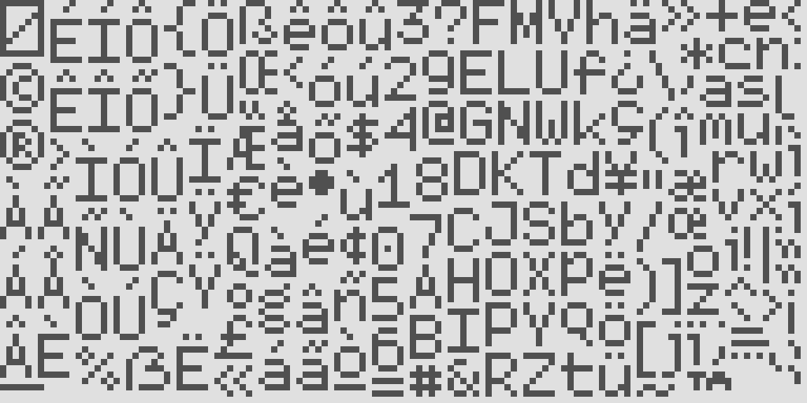

I use my own rectangle packer crate [crunch](https://crates.io/crates/crunch) to do this:

> Rust code
```rust
let PackedItems { w, h, mut items } = {
    let items: Vec<Item<usize>> = font
        .glyphs
        .iter()
        .enumerate()
        .filter(|(_, g)| g.pixels.len() > 0)
        .map(|(i, g)| {
            let w = ((g.max_pixel.x - g.min_pixel.x) + 2) as usize;
            let h = ((g.max_pixel.y - g.min_pixel.y) + 2) as usize;
            Item::new(i, w, h, Rotation::None)
        })
        .collect();
    crunch::pack_into_po2(2048, items).unwrap()
};
```

Because positioning info is lost in a tightly packed atlas, the data files for
these have a bit more information to help you render text correctly:

> JSON
```json
{
    "size": 12,
    "line_gap": 1,
    "space_w": 3,
    "glyphs": [
    {
        "chr": "\u0000",
        "x": 0,
        "y": 0,
        "w": 7,
        "h": 9,
        "off_x": 0,
        "off_y": -8,
        "adv": 8
    },
    {
        "chr": "!",
        "x": 118,
        "y": 36,
        "w": 1,
        "h": 7,
        "off_x": 0,
        "off_y": -7,
        "adv": 2
    },
```

These are serialized and exported into different formats in the same way as sheets:

> Rust code
```rust
#[derive(Debug, Serialize)]
struct Atlas {
    size: u32,
    line_gap: i16,
    space_w: i16,

    #[serde(skip_serializing_if = "Vec::is_empty", default)]
    glyphs: Vec<Glyph>,

    #[serde(skip_serializing_if = "Vec::is_empty", default)]
    kerning: Vec<KerningPair>,
}

#[derive(Debug, Serialize)]
struct Glyph {
    chr: char,
    x: usize,
    y: usize,
    w: usize,
    h: usize,
    off_x: i16,
    off_y: i16,
    adv: i16,
}

#[derive(Debug, Serialize)]
struct KerningPair {
    left: char,
    right: char,
    kern: i16,
}
```

## Step 6: Quality Testing

If I wanted to achieve the quality of fonts I desired, I knew there would have to be some
kind of system to make quality evaluation quick and easy. Once PIFO was up and running, I
added one more feature to it: the ability to generate gigantic sample images.

First, I start with displaying all the letters and a few test sentences. The sentences are
an excerpt from the short story [They're Made out of Meat](https://www.mit.edu/people/dpolicar/writing/prose/text/thinkingMeat.html) by Terry Bisson.

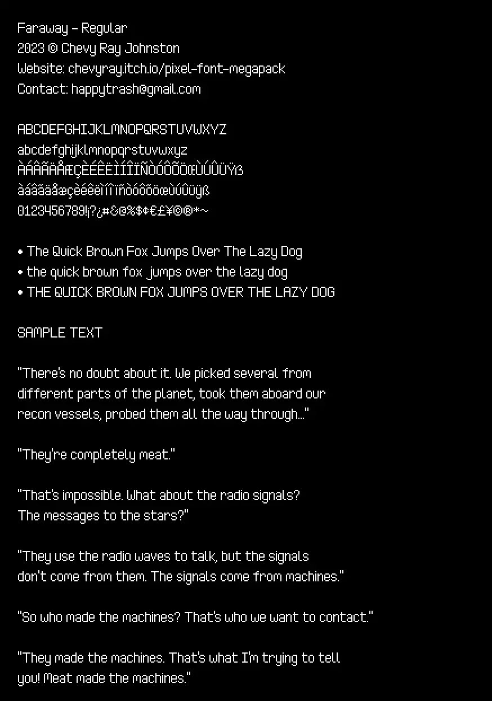

This is followed by a collection of test words. These words aren't random, and are taken from
[Text for Proofing Fonts: A farewell to The Quick Brown Fox](https://www.typography.com/blog/text-for-proofing-fonts),
a very useful strategy for improving font quality testing.

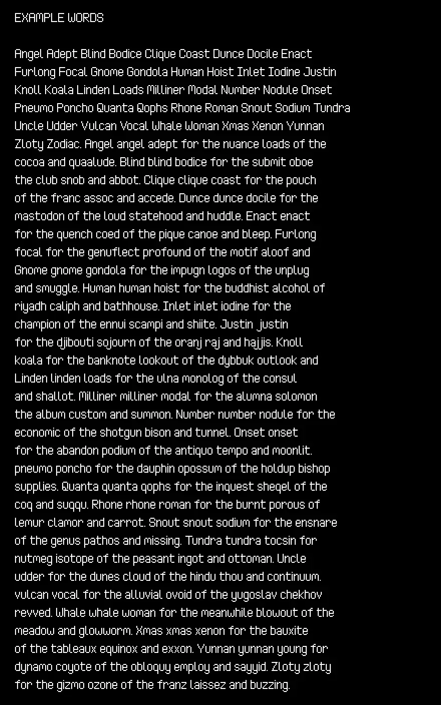

I want all combinations of digits to look nice, so next up I render all possible pairings
of those, as well as currency symbols:

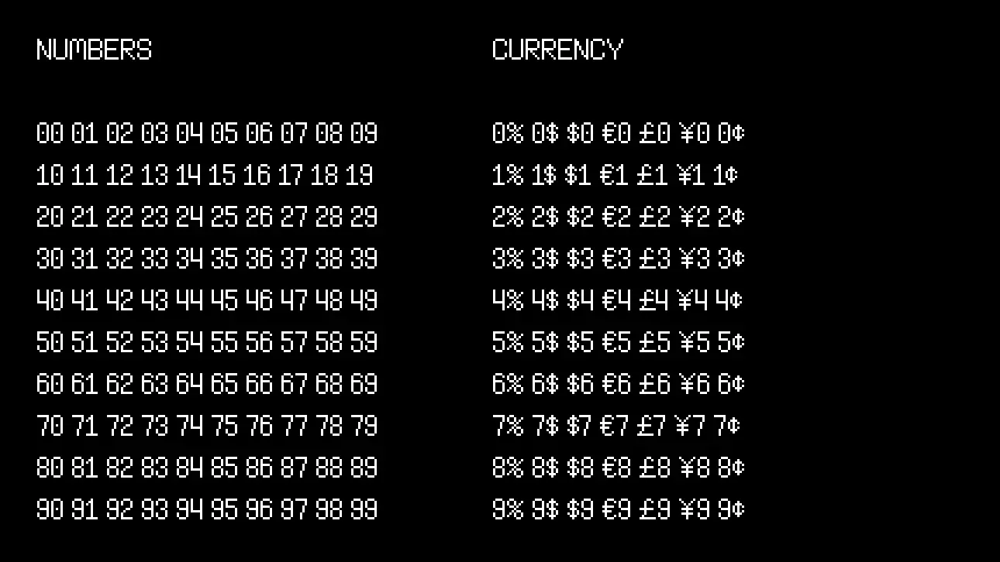

Then I render a huge row of uppercase, lowercase, and mixed-case kerning pairs:

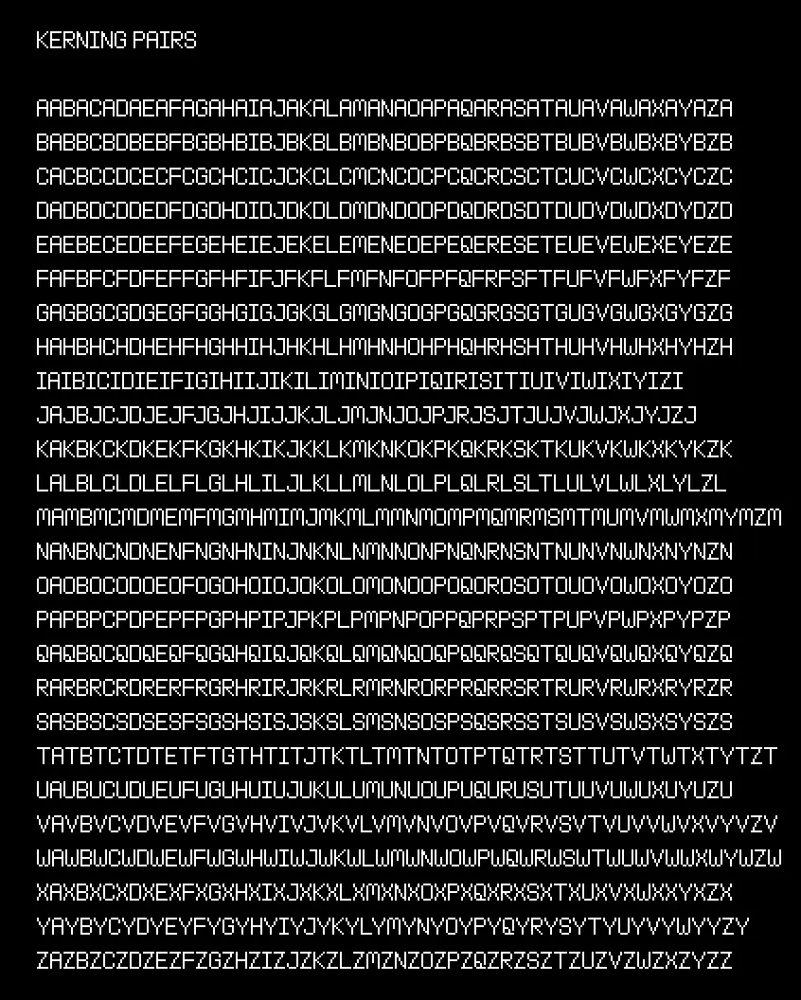

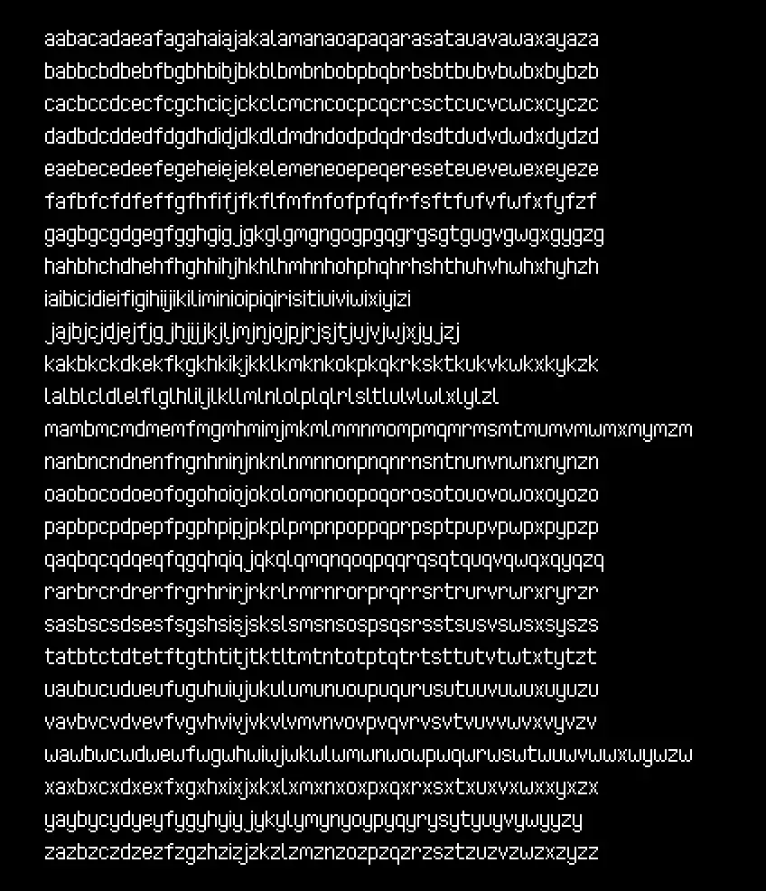

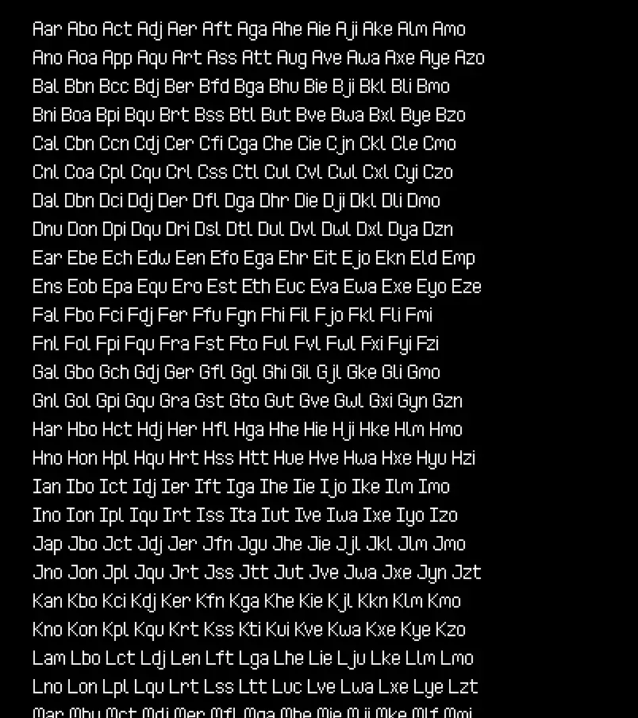

This last one continues for awhile. Finally, I render a bunch of test punctuation:

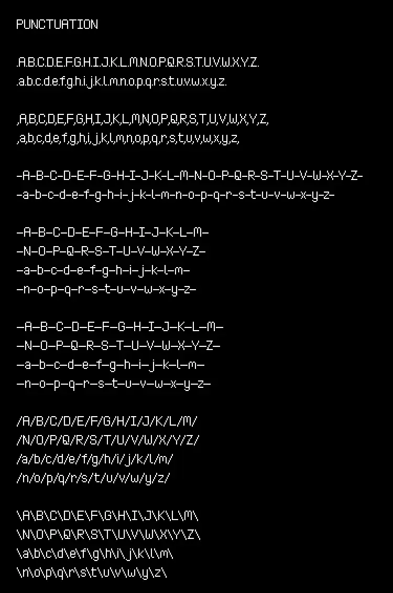

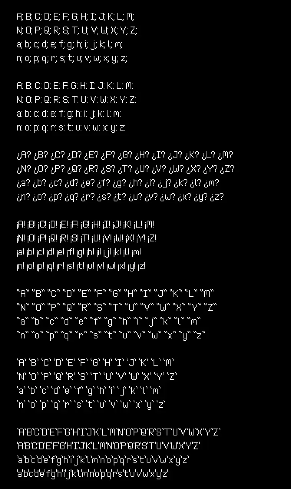

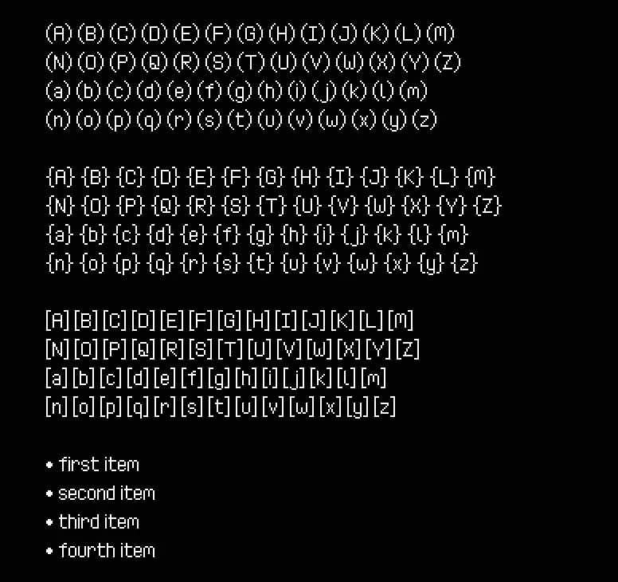

With PIFO immediately generating these sample images as I was working on the fonts,
I was able to improve and tweak them very quickly, greatly increasing the overall
quality and polish level of nearly 200 fonts!

## Step 7: Deployment

With my original goal of 100 fonts massively overshot, I now had a whopping **175 PIXEL FONTS**
to find a way to put up online for download. There are many places to sell things online, but
I decided to stick to my tried-and-true, [itch.io](https://itch.io/). 

<figure>
    
    <figcaption>itch.io is an open marketplace for indie creators</figcaption>
</figure>

### Creating itch.io Projects

The most tedious part of deployment was having to create an individual itch project for each of
the fonts.

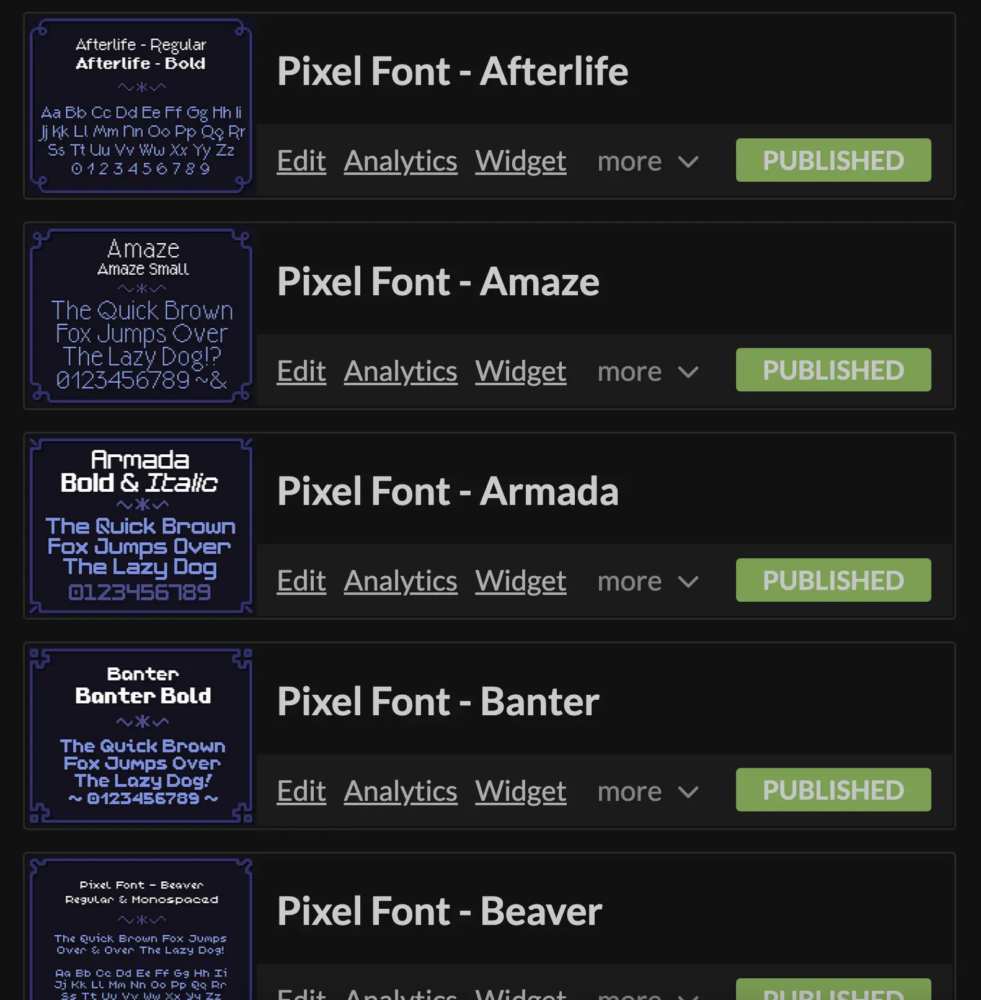

Luckily, I only had to do this once for each font. Once it was done, uploading and maintaining
them could be done completely via command line scripts.

### Building &amp; Uploading

My deployment script has three steps:

- make sure PIFO itself is compiled
- build the font assets
- update each font's itch project with the new assets

The first step is simple, I compile PIFO itself in release mode so it is as fast as possible:

> deploy.bat
```bat
cd pifo
cargo build --release || exit /b %errorlevel%
```

Next, I use PIFO to build the font I want.

> deploy.bat
```bat
cd ..\input
..\pifo\target\release\pifo --output "../distro/faraway" --all --input "Faraway*"
```

The `--input "Faraway*"` means that it will find *every* font that
starts with that text and compile/package them all together. So in this example,
there is `Faraway - Regular`, `Faraway - Bold`, etc. and they all get put together into
a single package for the "Faraway" font family.

Finally, for deployment, I use [`butler`](https://itch.io/docs/butler/), which is a super
handy command-line deployment tool provided by itch for exactly this purpose.

```bat
butler push ../distro/faraway chevyray/pixel-font-faraway:assets
```

Butler tracks changed files and only updates the parts it needs to, so I don't have to do
any file hashing or special versioning to save data.

## Conclusion

Phew, and that's how I shipped 175 pixel fonts on itch.io created using my own Rust tools!

I hope this was interesting, informative, or even helpful to people who are learning Rust
or are curious about what might go into a project of this scale. I really wanted to start
my new site off with a really high quality post, and I thought this would be a great subject.

If you'd like to see more content like this, a great way to support me is to
[buy my pixel fonts](https://chevyray.itch.io/) on itch.io, or share them around with others!

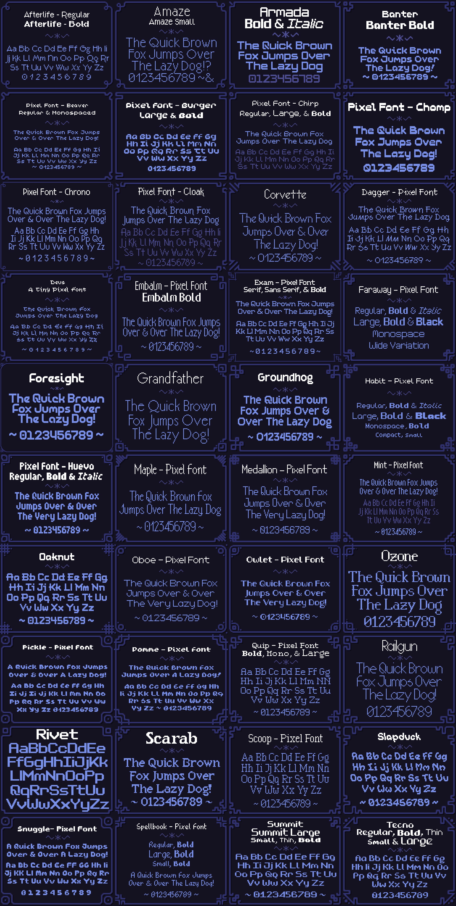