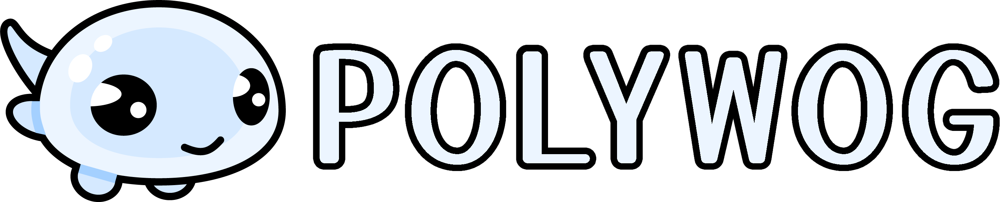

+++
title = "Polywog: Seeking Alpha Testers for a 2D Rust Game Framework"
slug = "polywog-alpha"
description = "Polywog is a 2D game framework that aims to be a MonoGame/Love2D/Raylib equivalent for Rust."
draft = true

[taxonomies]
tags = ["rust"]

[extra]
has_toc = true
+++

> <i class="ri-error-warning-line"></i>
> This library is currently in an **UNSTABLE ALPHA STATE** and should not be used for real
> projects at this time! 



## Introduction

### A 2D Rust Game Framework

Polywog is an approachable, cross-platform pure code framework for creating 2D games in Rust. It's
basically a Rust-powered version of [MonoGame](https://monogame.net/),
[LÖVE](https://www.love2d.org/), and [raylib](https://www.raylib.com/).

Today I have open sourced the project with the intent of finding **alpha testers** and
**more contributors** with the intent of polishing, stabilizing, and eventually releasing the
project as a serious game development tool.

- [<i class="ri-github-fill"></i> **SOURCE CODE**](https://github.com/feyworks/polywog)</span>
- [<i class="ri-discord-fill"></i> **DISCORD SERVER**](https://discord.gg/AYjNw9WHJa)

If you're interested in contacting me directly about the project, my contact information is at the
bottom of the page.

## Features

Polywog provides:

- 🌍 cross platform support for Windows (DX12), Linux (Vulkan) and macOS (Metal)
- 🖥️ a window, game loop, and rendering context out of the box and ready to go
- 🎮 mouse, keyboard, and gamepad input as well as virtual input mapping
- 🖼️ shaders, surfaces, textures, and other graphics resources
- 🖌️ a straightforward but powerful canvas-style drawing API
- 🧮 math types for working with vectors, matrices, rotations, etc.
- 📐 geometry types for various shapes, overlap testing, extraction, raycasting, etc.
- 🎨 image encoding/decoding, operate on pixels and different color formats
- 🧳 texture packing and other techniques for rendering optimization
- 🦀 full access to Rust's speed, power, ecosystem, and pleasure of use
- 🌙 full Lua bindings if desired, with LuaLS type annotations

Polywog is a pure-code framework that programmers can use to code their games or even to build their
own game engines. It is not a *game engine* itself, like [Godot](https://godotengine.org/) or
[Unity](https://unity.com/), so it has no editor nor concept of worlds and game objects.

## Quick Example

> Rust Code
```rust
use polywog::prelude::*;

fn main() -> Result<(), GameError> {
    env_logger::init();

    // create a game, set some options, and then run it
    polywog::new_game()
        .with_title("My Game")
        .with_size(1280, 720)
        .run::<MyGame>(())
}

// the game state is stored in a struct however you want
pub struct MyGame {
    counter: u32,
    image: Texture,
    noto_sans: Font,
}

impl Game for MyGame {
    type Config = ();

    // initialize your game state here, such as creating graphics resources, etc.
    fn new(ctx: &Context, cfg: Self::Config) -> Result<Self, GameError>
    where
        Self: Sized,
    {
        // create a texture out of a PNG embedded directly into the executable
        let image = ctx
            .graphics
            .load_png_from_memory(include_bytes!("../assets/image.png"), true)?;

        // load a font atlas out of an embedded TTF pixel font
        // we can easily report a custom error if the font fails to pack
        let (noto_sans, _) = Font::from_ttf_bytes(
            &ctx.graphics,
            include_bytes!("../assets/NotoSans-Regular.ttf"),
            48.0,
            false,
            BASIC_LATIN.chars(),
        )?
        .ok_or_else(|| GameError::custom("failed to pack font atlas"))?;

        // create the game state
        Ok(Self {
            counter: 0,
            image,
            noto_sans,
        })
    }

    // perform your game logic here
    fn update(&mut self, ctx: &Context) -> Result<(), GameError> {
        if ctx.keyboard.pressed(Key::Space) {
            self.counter += 1;
        }
        Ok(())
    }

    // perform your drawing code here
    fn render(&mut self, ctx: &Context, draw: &mut Draw) -> Result<(), GameError> {
        // draw the image in the center of the window
        let top_left = (ctx.window.size() - self.image.size()) / 2;
        draw.texture_at(&self.image, top_left.to_f32());

        // draw a circle at the mouse position
        draw.circle(circle(ctx.mouse.pos(), 50.0), Rgba8::ORANGE_RED, None);

        // draw our spacebar counter
        let txt = format!("SPACE pressed {} times", self.counter);
        draw.text(&txt, vec2(8.0, 48.0), &self.noto_sans, Rgba8::WHITE, None);

        Ok(())
    }
}
```

<video width="100%" controls>
  <source src="example_code.mp4" type="video/mp4">
</video>